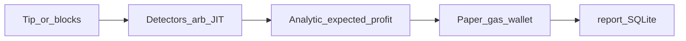
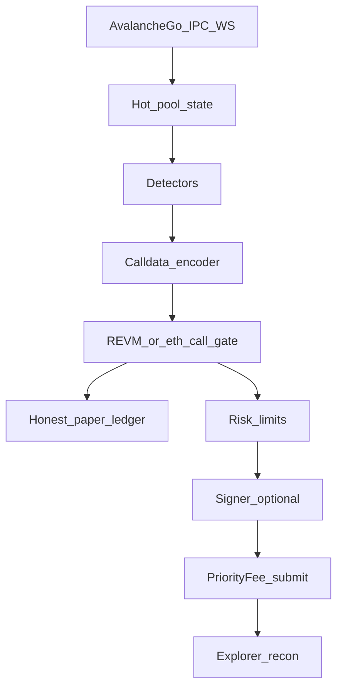

# پلن جامع بات MEV (Avalanche-first)

## تصمیم‌های قفل‌شده

- زنجیرهٔ اصلی: **Avalanche C-Chain** (نود لوکال طبق [`docs/LOCAL_AVALANCHE.md`](docs/LOCAL_AVALANCHE.md))؛ چندزنجیره فقط بعد از سود پایدار روی AVAX.
- استراتژی فاز A: همان‌های کدشده — `TwoHopArb` / `MultiHopArb` / `Jit` ([`core/src/types/strategy.rs`](core/src/types/strategy.rs)).
- گسترش بعدی: از [`docs/mev_strategies.md`](docs/mev_strategies.md) §§9–14 و §19، با اولویت **capital-free + کم‌رقیب + سود معقول / effort پایین** روی AVAX.
- قرارداد: **Solidity + Foundry** در `contracts/` (نه Huff در فاز اول). سطح: **flash callback + batch calldata executor** (owner-only، profit gate). Flash پیش‌فرض AVAX: **Balancer Vault 0%** سپس Aave؛ Morpho/V4 وقتی روی هدف موجود باشند.
- سابمیت AVAX: **priority-fee + `eth_sendRawTransaction`**؛ بدون Flashbots. لبهٔ latency = **AvalancheGo IPC** (§19).
- تا پایان فاز C هیچ broadcast اصلی بدون فلگ سخت `execution.enabled=false` پیش‌فرض و kill-switch.

## وضعیت امروز (baseline)



- `live` = تشخیص + لجر گازی بدون رقابت ([`docs/ARCHITECTURE.md`](docs/ARCHITECTURE.md) §4.7: *no Solidity executor*).
- صفر فایل `.sol`؛ flash فقط fee/overhead در Rust ([`FlashLoanProvider`](core/src/types/strategy.rs)).
- `paper::recon` / `replay::whatif` برای تست هستند، نه گیت fill در `live`.
- Mempool: `capture_pending` پیش‌فرض off؛ اثر pending روی state کامل نیست.

هدف نهایی:



---

## فاز 0 — قرارداد Executor (P0 زیرساخت)

**هدف:** سطح اجرایی که همهٔ مسیرهای flash/batch روی آن سوار شوند.

- اسکفلد Foundry در `contracts/` (forge, tests, script deploy).
- قرارداد مینیمال مثلاً `Executor.sol`:
  - `onlyOwner` / allowlist caller
  - ورود flash (Balancer `receiveFlashLoan` اول)
  - `execute(Call[] calls)` اتمیک داخل callback
  - repay + `minProfit` revert اگر سود ناکافی
  - بدون منطق استراتژی on-chain
- تست‌های Foundry: flash موفق، batch چند hop، revert روی سود منفی، رد caller غیرمجاز.
- آدرس دیپلوی (fuji/mainnet) در config TOML، نه hardcode در detector.

**Gate:** تست‌های قرارداد سبز؛ ABI ثابت برای فاز 1.

---

## فاز 1 — Encoder + Simulate-before-book (قلب paper واقعی)

**هدف:** fill فقط وقتی payload ساخته‌شده واقعاً اجرا می‌شود.

- ماژول جدید Rust مثلاً `core/src/execution/`:
  - `encode_opportunity(MevOpportunity) -> TxRequest` روی ABI Executor
  - مسیرهای two-hop / multi-hop با flash؛ JIT با مسیر جدا (موجودی LP — در paper مدل موجودی، در live واقعی فقط بعداً)
- گیت در [`core/src/jobs/live.rs`](core/src/jobs/live.rs) / ledger: قبل از `PaperFill`، `eth_call` روی tip یا `execute_whatif` (reuse [`core/src/paper/recon.rs`](core/src/paper/recon.rs) / replay).
- Skip reasons جدید: `SimRevert`, `SimNotProfitable`, `EncodeUnsupported`.
- `report`: نرخ pass شبیه‌سازی در هر سشن.

**Gate:** در `live --loop` روی AVAX، >X% fillها sim-pass دارند و corpus `paper_corpus` سبز می‌ماند.

---

## فاز 2 — Paper صادقانه (زمان، mempool، رقابت)

**هدف:** P&L «اگر الان جستجوگر بودیم» نه «اگر همه چیز را بعد از ماین می‌گرفتیم».

- `capture_pending=true` مسیر اول‌کلاس در live؛ اعمال اثر pending روی pool state (Phase 2+ در [`mempool.rs`](core/src/mev/detectors/mempool.rs)).
- مدل inclusion: decay فرصت‌های mined، miss از latency poll.
- Competition haircut در ledger: از miss rate در مقابل [`explorer`](core/src/explorer/) + premium tip (نه فقط `winning_bid_premium` تخت).
- لجر موجودی توکن برای مسیرهای غیر-flash؛ gas wallet + reserve مثل الان تقویت شود.
- Risk: daily loss، max drawdown به‌عنوان حد، kill-switch استراتژی، سقف fills.

**Gate:** سشن paper و `explorer` روی همان پنجره هم‌راستا در بازهٔ قابل توضیح؛ لیبل از `theoretical, no competition` به `paper (sim+competition model)` عوض شود.

---

## فاز 3 — موتور اجرای guarded روی Avalanche

**هدف:** مسیر واقعی با پیش‌فرض خاموش.

- Signer (keystore/env)، nonce manager، gas از tip (`GasModel::Live`).
- ساخت tx امضاشده؛ پیش‌فرض فقط dry-run / sim.
- فلگ‌های سخت: `execution.enabled`, `execution.broadcast`, chain_id=43114 assert، max gas spend / session.
- Submit با priority fee؛ لاگ tx hash؛ recon با receipt و مقایسه با paper fill.
- CLI: مثلاً `live --execute` فقط وقتی هر دو فلگ روشن و sim-pass.

**Gate:** fuji یا mainnet با سقف خیلی کوچک؛ صفر broadcast تصادفی در CI/default config.

---

## فاز 4 — سرعت زیرساخت AVAX (قبل از استراتژی‌های جدید زیاد)

**هدف:** لبهٔ رقابتی واقعی روی C-Chain (§19: IPC بالاترین ROI زیرساخت).

- اتصال AvalancheGo IPC / WS محلی برای pending + heads (جایگزین/مکمل poll 2s).
- Hot path: state در حافظه، invalidate روی لاگ، کاهش RPC در مسیر detect→encode→sim.
- موازی‌سازی encode/sim برای کاندیدها؛ بودجهٔ زمانی per-block.
- متریک: time-to-detect، time-to-sim، time-to-submit، inclusion rate.
- بعداً (نه الان): Yul/Huff optimize روی hot paths قرارداد.

**Gate:** p99 مسیر detect→sim زیر هدف مشخص (مثلاً ≪ interval بلاک AVAX) روی نود لوکال.

---

## فاز 5 — تکمیل استراتژی‌های فعلی تا production

| استراتژی | کار باقی‌مانده |
|----------|----------------|
| Two/Multi-hop | Encoder flash کامل روی Joe/Pharaoh/LFJ/V2/V3/Curve موجود؛ long-tail universe با `discover` hybrid |
| JIT V3 | فقط بعد از موجودی/مدل capital؛ paper با inventory ledger؛ live با سرمایه جدا |
| کیفیت | هم‌راستا کردن docs (§16 که `execution/live.rs` و استراتژی‌های حذف‌شده را overstate می‌کند) با کد واقعی |

**Gate:** arb flash capital-free در paper+sim پایدار؛ JIT جدا با label capital-required.

---

## فاز 6 — موج استراتژی بعدی (رتبه‌بندی از `mev_strategies.md`)

ترتیب بعد از پایدار شدن فازهای 0–5 روی AVAX. معیار: capital-free یا low-cap، competition پایین، effort معقول، سود قابل قبول، حضور/معناداری روی Avalanche (§11، §14، §19).

### موج 6A — pipeline validators + AVAX-native (اولویت بالا)

1. **skim() capture** (§1.1) — validate executor؛ effort خیلی کم  
2. **Trader Joe LB deepen** (§7.13) — arb/bin؛ competition ~2؛ سطح AVAX اصلی  
3. **Long-tail arb / SPFA** (§2.2) — flash؛ competition ~3  
4. **Backrunning** (§2.1) — mempool+sim+priority fee (بدون private relay)  
5. **Interest accrual liquidation** (§4.13) — capital-free؛ competition ~2؛ نیاز unwind `liquidation` detector  

### موج 6B — keeper / factory روی AVAX

6. **GMX v1 keeper** (§4.11) — gas-only؛ روی AVAX کمتر از Arb رقابت  
7. **Init price / factory snipe** (§1.4) — flash swap؛ PairCreated  
8. **Pharaoh epoch** (§7.5-class) — medium capital؛ competition خیلی پایین؛ بعد از جریان نقدی  

### موج 6C — liquidation flash و سطوح Part IV (وقتی lending روی هدف باشد)

9. **Flash loan atomic liq** (§4.4) روی بازارهای AVAX (Aave و مشابه)  
10. **Owner-side salvage / refinancing** (§20–§22) اگر پروتکل‌ها روی AVAX زنده باشند  
11. **Rebase / FoT arb** (§5.3–§5.4) فرصت‌طلبانه  

### موج 6D — سرمایه / پیچیدگی بالا (عمداً دیر)

- JIT V3 با سرمایه واقعی، JIT+arb (§3.3)، oracle-latency liq، cascading liq، multi-block  
- فقط بعد از درآمد پایدار فازهای قبل  

### عمداً خارج / خیلی دیر (از §15 و §19)

- CEX–DEX سطح بالا، sandwich ETH L1، TWAP manipulation، NFT floor، Governance MEV، PBS/block building  
- Maker OSM / V4 hooks تا وقتی زنجیره عوض نشده (ETH/Base)

هر استراتژی جدید: detector → encode روی همان Executor → sim gate → paper → (اختیاری) execute. بدون دور زدن فاز 1.

---

## فاز 7 — بات «کامل + خیلی سریع» (hardening)

- Dashboard عملیاتی: inclusion، sim-fail reasons، P&L واقعی vs paper، RPC health  
- Reorg safety، nonce stuck recovery، circuit breaker روی خطای متوالی  
- Pool universe refresh پیوسته؛ health filter تهاجمی برای مسیر hot  
- Multi-instance: یک writer nonce؛ یا sharding استراتژی/استخر  
- آماده‌سازی chain #2 فقط وقتی AVAX metrics سبز است  

---

## ترتیب اجرا (از مهم‌ترین)

```text
0 Executor Solidity+Foundry
1 Encoder + sim-before-book در live
2 Paper صادقانه (mempool/timing/competition/risk)
3 Execution guarded (پیش‌فرض off)
4 IPC + hot-path latency
5 Arb/JIT production-complete روی AVAX
6A→6D استراتژی‌های ranked از mev_strategies.md
7 Hardening + سرعت نهایی
```

## فایل‌ها / سطح‌های کلیدی

- جدید: `contracts/` (Foundry + Executor)
- جدید: `core/src/execution/` (encode, sim gate, submit stubs)
- تغییر: [`core/src/jobs/live.rs`](core/src/jobs/live.rs), [`core/src/paper/`](core/src/paper/), [`core/src/mev/detectors/mempool.rs`](core/src/mev/detectors/mempool.rs)
- config: [`mev-scout.example.toml`](mev-scout.example.toml) بخش `[execution]` / `[paper]`
- docs: [`README.md`](README.md), [`docs/ARCHITECTURE.md`](docs/ARCHITECTURE.md), اصلاح وضعیت در [`docs/mev_strategies.md`](docs/mev_strategies.md) §16

## اصل کیفیت

درستی و قابل‌اعتماد بودن paper/sim قبل از سرعت؛ سرعت قبل از کاتالوگ استراتژی بزرگ. استراتژی جدید بدون encoder+sim روی Executor وارد production نمی‌شود.
