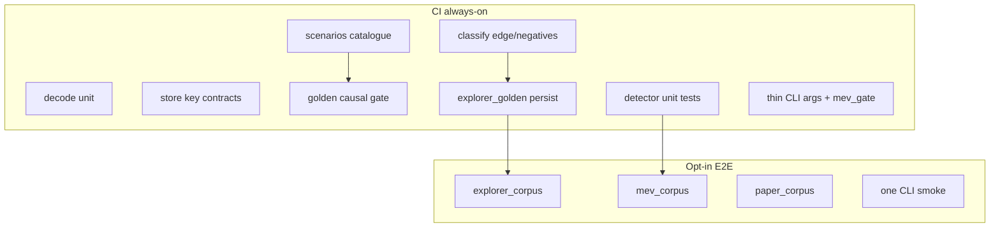

# پلن جامع Clean Code + تحکیم تست‌ها

## هدف

سیگنال regression را نگه داریم (و در detectors قوی‌تر کنیم)، نویز/تکرار تست و god-fileها را کم کنیم، و مرزهای typed/error را در [`core`](core) سخت‌تر کنیم — بدون یک mega-PR.

## تصمیم‌های قفل‌شده

- **منبع حقیقت synthetic استراتژی:** [`core/src/explorer/scenarios.rs`](core/src/explorer/scenarios.rs) + [`scenario_targets.rs`](core/src/explorer/scenario_targets.rs) / [`docs/explorer_strategy_scenarios.md`](docs/explorer_strategy_scenarios.md). baseline و tagهای P0–P3 اینجا می‌مانند.
- **نقش `classify` tests:** فقط edge/negative و قراردادهای داخلی که در scenarios نیستند؛ duplicateهای baseline/tag حذف می‌شوند.
- **یک مسیر persist مصنوعی:** [`core/tests/explorer_golden.rs`](core/tests/explorer_golden.rs) نگه؛ roundtripهای تکراری store کم می‌شوند.
- **causal ship gate:** [`core/src/explorer/golden.rs`](core/src/explorer/golden.rs) دست‌نخورده از نظر نقش.
- **corpus / CLI live:** gated با `MEV_SCOUT_E2E` می‌مانند؛ smokeهای هم‌بستهٔ tip کم می‌شوند، نه خودِ corpus.
- **API surface:** در موج‌های بعدی به‌تدریج `pub`های غیرضروری explorer به `pub(crate)`؛ بدون شکستن CLI در همان PR اول.
- **dead code:** unusedهای **production** حذف یا wire می‌شوند؛ `#![allow(dead_code)]` فقط برای harness/fixtures مشترک مجاز است (نه پنهان‌کردن API مرده در `cli`/`core` غیرتست).

---

## موج 0 — Quick wins (کم‌ریسک، ۱–۲ PR)

### Clean Code
- در [`core/src/explorer/ingest.rs`](core/src/explorer/ingest.rs) خطوط `let _ = store.record_oracle_answers` / `record_reserve_rates`: خطا را با `tracing::warn!` (و در صورت امکان metric) لاگ کن؛ silent discard تمام نشود. اگر قرارداد lookback durability سخت است، در PR جدا `?` را ارزیابی کن.
- [`DetectionPath`](core/src/mev/detectors/mod.rs) را روی [`MevOpportunity.detection_path`](core/src/types/opportunity.rs) بنشان (serde string سازگار با DB موجود: `replay` / `log_only` / `pending`). فراخوانی‌های `.to_string()` در `arb_common` / `jit` / `mempool` را عوض کن.

### تست
- در [`cli/tests/cli_args.rs`](cli/tests/cli_args.rs): ده تست `removed_*_subcommand_fails` را به یک تست table-driven تبدیل کن؛ یک تست جدا برای kept surface.
- ماژول مشترک fixture زیر `cfg(test)` بساز: مثلاً [`core/src/explorer/test_fixtures.rs`](core/src/explorer/test_fixtures.rs) با آدرس‌ها و builders مشترک (`ATK`, `POOL_*`, swap/transfer) که الان بین `classify::tests` و `scenarios` duplicateاند. `scenarios` و تست‌های باقی‌ماندهٔ classify از آن استفاده کنند.

**خروجی موج 0:** CI سبز، بدون تغییر رفتار classify؛ کمتر clap noise؛ پایهٔ fixture مشترک.

---

## موج 1 — تحکیم تست explorer (۲–۳ PR)

1. **ممیزی duplicate:** جدول tag/baseline که هم در `classify.rs` tests و هم در `scenarios.rs` assert می‌شود؛ نسخهٔ classify را حذف کن مگر negative/edge منحصربه‌فرد داشته باشد.
2. **store tests را نازک کن** در [`core/src/explorer/store.rs`](core/src/explorer/store.rs): نگه دار — multi-residual USD، sandwich loss gate، liquidation PnL modes، competitors/trace. حذف/ادغام — roundtripهای خالص schema/serde که با `explorer_golden` هم‌پوشان‌اند.
3. **یک smoke زندهٔ هسته + یک smoke CLI** را به‌عنوان قرارداد بنویس (در README تست یا [`cli/tests/README.md`](cli/tests/README.md)): بقیهٔ tip-smokeهای هم‌بسته را demote یا ادغام کن بدون دست زدن به floors کورپوس.
4. **docs:** یک پاراگراف در [`docs/explorer_strategy_scenarios.md`](docs/explorer_strategy_scenarios.md) که نقش لایه‌ها را قفل کند (scenarios = catalogue، classify = edges، golden = causal gate، corpus = real).

**هدف کمی:** حدود ۴۰–۸۰ تست always-on کمتر، بدون افت سیگنال kind/tag/pnl.

---

## موج 2 — DetectCtx + unit تست detectors (۲–۳ PR)

### Clean Code
- struct مشترک context (مثلاً `DetectCtx` / `BlockDetectCtx`) با فیلدهای تکراری: `block_number`, `tx_index`, `timestamp`, `base_fee`, gas/scope — و جایگز کردن signatureهای `too_many_arguments` در [`two_hop.rs`](core/src/mev/detectors/two_hop.rs)، [`backrun.rs`](core/src/mev/detectors/backrun.rs)، [`jit.rs`](core/src/mev/detectors/jit.rs)، و نقاط مشابه classify/store که فقط plumbingاند.
- الگوی موجود [`ArbOpportunityInput`](core/src/mev/detectors/arb_common.rs) را گسترش بده، دوباره اختراع نکن.

### تست
- unit کنار ماژول برای `two_hop` (prefilter/dedup)، `backrun` (net-flip/dedup از [`core/tests/backrun.rs`](core/tests/backrun.rs) منتقل/استخراج)، `jit` (mint→swap→burn مصنوعی بدون نیاز به revm کامل).
- integrationهای چاق را نازک نگه دار: فقط wiring + یک مسیر end-to-end.
- `mempool` / `arb_common`: حداقل ۱–۲ تست قرارداد مسیر `detection_path` و prefilter.

**نتیجه:** clippy allowهای `too_many_arguments` روی detectors کم می‌شود؛ پوشش unit جایی که الان سوراخ است پر می‌شود (تعداد کل تست ممکن است موقتاً ثابت بماند یا کمی بالا برود — نسبت سیگنال بهتر است).

---

## موج 3 — شکستن god-fileهای explorer (۳–۴ PR)

ترتیب پیشنهادی (هر PR کامپایل+تست سبز):

### 3a — `classify` را per-kind جدا کن
[`core/src/explorer/classify.rs`](core/src/explorer/classify.rs) (~4k) → مثلاً:

- `classify/mod.rs` — `classify_block` و اولویت kindها (همان قرارداد فعلی در docs ماژول)
- `classify/liquidation.rs`, `sandwich.rs`, `arb.rs`, `jit.rs`, `skim.rs`, `causal.rs` (frontrun/backrun), helpers مشترک

تست‌های edge باقی‌مانده کنار همان sub-module یا در `classify/tests`.

### 3b — `ExplorerStore` را برش بزن
[`core/src/explorer/store.rs`](core/src/explorer/store.rs) (~3.4k) → زیر `explorer/store/`:

- `schema` / migrate
- `facts` (insert_block_facts + OpportunityInput/BlockFactsInput)
- `query` / stats / report
- `labels` / rejections
- `jit_positions` / pricing tables

Facade نازک `ExplorerStore` برای CLI حفظ شود تا موج visibility جدا بماند.

### 3c — typed details در مرز persist
- `BundleLeg.role` و فیلدهای stringly در [`types.rs`](core/src/explorer/types.rs) / [`MevOpRow`](core/src/explorer/store.rs) را به enum + parse هنگام خواندن از SQLite ببر.
- liquidation PnL را از کندن کلیدهای `serde_json::Value` در store جدا کن → struct جزئیات در classify ساخته شود.

---

## موج 4 — Error model + visibility (۱–۲ PR)

- [`core/src/error/mod.rs`](core/src/error/mod.rs): به‌جای قیف `anyhow → Other(String)`، variantهای معنادار اضافه کن (حداقل `Sqlite`, `Rpc`, `Decode` یا explorer-local `thiserror`) و مرز jobs را روی typed failure برای retry/classify بگذار.
- ratchet ادامهٔ [`Cargo.toml`](Cargo.toml) workspace lints: جایی که unit جدید آمد، به‌تدریج `unwrap_used` را در آن ماژول‌ها به deny نزدیک کن (کل crate یک‌شبه نه).
- visibility: `explorer::{classify, store, ingest, pricing}` را در حد ممکن `pub(crate)` کن؛ فقط re-exportهای لازم برای CLI/`jobs` بماند. ریشهٔ [`lib.rs`](core/src/lib.rs) را در همان PR بیش‌ازحد شلوغ نکن — ماژول‌به‌ماژول.

---

## موج 5 — dead code audit + بدهی باقی‌مانده (۱–۲ PR)

### 5a — پیدا و پاک‌کردن dead / unused (الزامی در این پلن)

بعد از موج ۴ (visibility تنگ‌تر → unusedهای پنهان‌شده بهتر دیده می‌شوند):

1. **Inventory:** `cargo clippy -p mev-scout-core -p mev-scout-cli --all-targets` با تمرکز روی `dead_code` / `unused_*`؛ همچنین جستجوی `#[allow(dead_code)]` و `#![allow(dead_code)]` در ریپو.
2. **Production first:** آیتم‌های unused در `core/src` و `cli/src` (غیر از `#[cfg(test)]`) را یا حذف کن، یا اگر هنوز لازم‌اند wire کن و allow را بردار. نقطهٔ شناخته‌شده: [`cli/src/commands/explorer/show.rs`](cli/src/commands/explorer/show.rs) (`#[allow(dead_code)]`).
3. **Harness/fixtures:** allowهای ماژول‌سطح در [`core/tests/common/setup.rs`](core/tests/common/setup.rs)، [`cli/tests/common/mod.rs`](cli/tests/common/mod.rs)، و builders در [`scenarios.rs`](core/src/explorer/scenarios.rs) / `test_fixtures` را نگه دار **فقط** اگر helper واقعاً اشتراکی است؛ در غیر این صورت helper مرده را حذف و allow را تنگ کن (ترجیحاً روی آیتم، نه کل فایل).
4. **Examples:** [`core/examples/conn_check.rs`](core/examples/conn_check.rs) را جدا از production ارزیابی کن — یا allow موجه بماند یا کد مرده تمیز شود.
5. **خروجی:** لیست کوتاه در PR (حذف‌شده / نگه با دلیل)؛ بدون تغییر رفتار runtime مگر حذف مسیر واقعاً unreachable.

### 5b — اختیاری / دیرتر

- کاهش هم‌پوشانی `jobs/live` ledger tests با [`paper/ledger.rs`](core/src/paper/ledger.rs) در صورت تکرار واقعی.
- بازبینی `pipeline/runner.rs` فقط بعد از پایدار شدن store/classify split (orchestration، نه اولویت اول).
- JIT detector vs realizer gap که در `mev_corpus` مستند است: جدا از این پلن؛ نیاز به fidelity replay دارد.

---

## ترتیب اجرا و ریسک

| موج | تمرکز | ریسک | وابستگی |
|-----|--------|------|----------|
| 0 | ingest warn + DetectionPath + CLI table + fixtures | پایین | — |
| 1 | حذف duplicate classify/scenarios + نازک store/CLI smoke | پایین–متوسط | fixtures از 0 |
| 2 | DetectCtx + detector units | متوسط | — موازی با 1 ممکن |
| 3 | split classify/store + typed rows | متوسط–بالا | fixtures/تست‌های تثبیت‌شده |
| 4 | Error + pub surface | متوسط | بعد از facade store |
| 5 | dead-code audit + پاکسازی unused | پایین–متوسط | بهتر بعد از موج 4 (visibility) |

هر موج = یک یا چند PR با عنوان واضح؛ بعد از هر موج `cargo test -p mev-scout-core` (و در صورت لمس CLI، `-p mev-scout-cli`) سبز.

## خارج از محدودهٔ این پلن

- بازنویسی استراتژی detection یا تغییر آستانه‌های corpus floors
- force-denying `unwrap_used` روی کل workspace در یک PR
- refactor کامل `pipeline/runner` یا discovery/math
