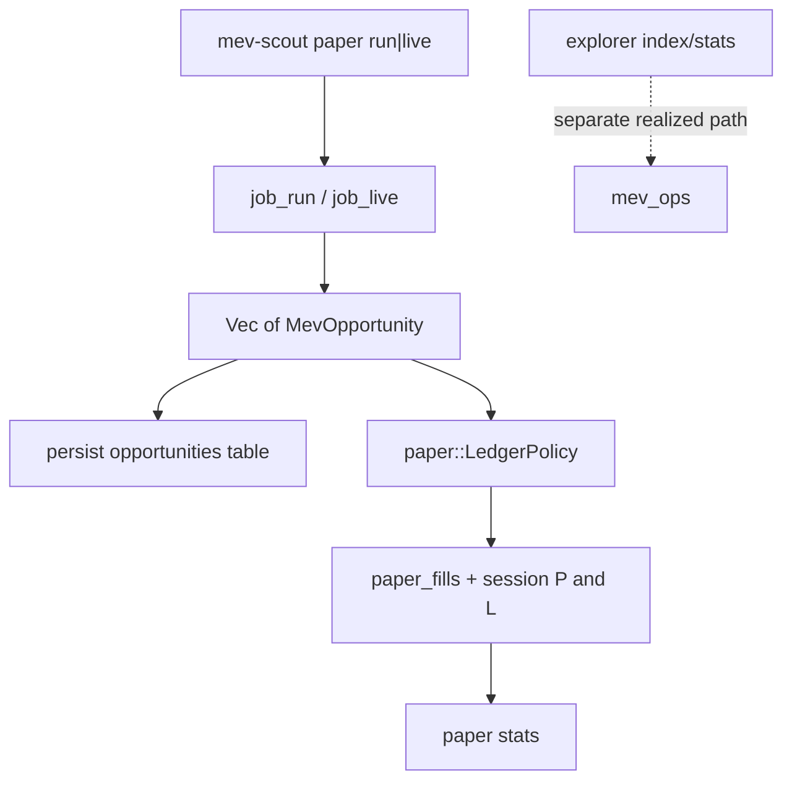
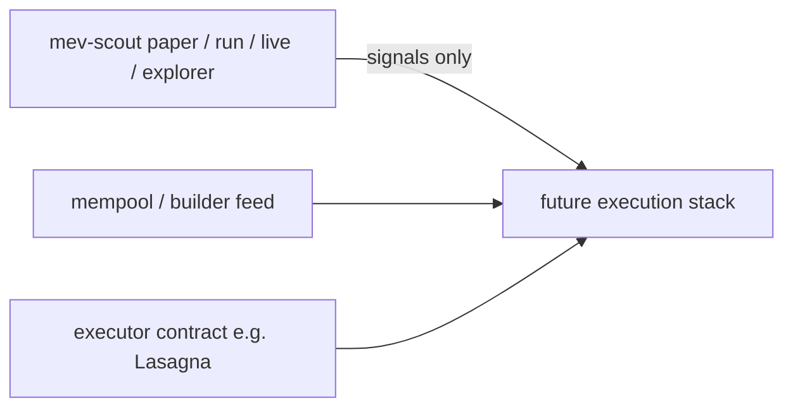

# Paper command: virtual-fund bot P&amp;L

## Problem and product question

| Surface | Question |
|---------|----------|
| `run` / `live` | What opportunities *could* exist? |
| `explorer` | What was *actually* extracted? |
| **`paper` (new)** | If we traded those detections like a bot with virtual funds, what would **our** P&amp;L have been? |

`live` stays detection-only. Paper is a separate command so modes stay distinct (spec: Candidate ≠ Opportunity ≠ Realized; theoretical ≠ executable).

## Decision (locked)

- **CLI:** new top-level `mev-scout paper` with subcommands `run`, `live`, `stats` (same nesting pattern as `explorer`).
- **Detection:** reuse `job_run` / `job_live` unchanged; paper is a post-detection ledger layer.
- **Capital model (v1):** flash-loan style (matches current detectors / `GasConfig`). No token inventory. Track a **native gas wallet**; per accepted fill the net wallet delta is a **single** subtraction `wallet += expected_profit - gas_cost_wei`, gated on `gas_cost_wei <= wallet`. Do **not** debit gas *and* credit net — that double-counts gas as `profit - 2·gas`. `expected_profit` is native-normalized in detectors (`raw_profit` pins the pre-normalization value), consistent with `pipeline/aggregate.rs` gross−gas semantics.
- **Eligibility (v1):** fills come from strategies whose `expected_profit` is native-normalized (two_hop_arb, multi_hop_arb, jit, jit_arb, sandwich). Liquidation profit is arbitrary-token; skip with `FillSkipReason::NotNativeUnit` until a conversion policy exists. `mempool_only` opps participate but sort after tx-anchored opps in the same block (tie-break below).
- **Selection (v1):** per block, sort by net wei descending; accept greedily; skip if gas wallet cannot cover gas or if the opp shares a pool with an already-accepted fill in that block (avoids naive sum of conflicting candidates).
- **Out of v1:** competition, inclusion failure, builder tips, own-capital inventory, mempool latency, Solidity executor. Document as future competition-aware / execution stack (spec §29.2).
- **Persistence:** new tables in the existing explorer SQLite (`explorer_{chain}.sqlite`) — not cache, not `mev_ops` — so fills can join `opportunities` by `run_id` / `canonical_id`.
- **No mempool, no Lasagna-like contract in v1** — paper is offline/tip-block simulation accounting only; a live bot would add those later as a separate execution stack.

## Architecture



Per-opp net (already implied by runner filter, not stored):

```text
net_wei = expected_profit - gas_cost_wei   # single subtraction = wallet delta
# arb expected_profit already has flash-loan fee subtracted in detectors
# per-fill display columns (gross_wei / gas_wei / net_wei) are re-derived from
# the single wallet delta at persist time — never summed twice.
```

## CLI surface

Add to [`cli/src/cli.rs`](cli/src/cli.rs):

```text
mev-scout paper run --days 7
mev-scout paper live --loop --duration 1h
mev-scout paper sim --run run_<ID> [--wallet-multiplier 2]   # offline replay, no RPC
mev-scout paper stats [--session ID | --since 7d]
```

- `paper run` / `paper live`: same range / loop flags as [`RunArgs`](cli/src/cli.rs) / [`LiveArgs`](cli/src/cli.rs).
- `paper sim`: re-runs the **pure** ledger over stored opportunities for an existing run (hydrated via `ExplorerStore::opportunities_by_run`), so "what if 2× wallet?" needs no RPC or re-detection.
- Config (TOML `[paper]`): `starting_gas_wei` (required for meaningful wallet), optional `max_fills_per_block` (default unlimited within conflict rule, hard safety cap 32/block so a pathological block cannot produce a huge session), optional `reserve_wei` (kept idle so one large fill cannot starve later blocks).
- Every table/JSON header labeled `PAPER (theoretical, no competition)`.

Wire through [`cli/src/commands/mod.rs`](cli/src/commands/mod.rs), [`cli/src/overrides.rs`](cli/src/overrides.rs), [`cli/src/main.rs`](cli/src/main.rs) (progress sink like `Run`/`Live`).

## Core module

New crate module [`core/src/paper/`](core/src/paper/) (or `core/src/jobs/paper.rs` + `core/src/paper/`):

| Piece | Role |
|-------|------|
| `types.rs` | `PaperSession`, `PaperFill`, `FillSkipReason` (incl. `NotNativeUnit`) |
| `ledger.rs` | **Pure** `LedgerPolicy::apply(&[MevOpportunity]) -> LedgerResult` — gas wallet, `reserve_wei`, pool conflict set, `wallet_before`/`wallet_after` per fill. No I/O. |
| `store.rs` | SQLite DDL + insert/query helpers on explorer DB connection |
| `job` in `jobs/paper.rs` | Orchestrate: call `job_run`/`job_live` (or replay from store), then ledger, persist session |

The ledger being pure (no I/O) lets two feed paths produce identical results:
- `paper run` / `paper live`: in-memory opps from `job_run` / `job_live`.
- `paper sim --run <ID>`: opps hydrated from the persisted `opportunities` table — all required fields (`pool_a`, `pool_b`, `path`, `expected_profit`, `gas_cost_wei`, `canonical_id`) are stored at insert time (core/src/explorer/store.rs:818).

**`job_paper_live` does not reuse `job_live`'s loop path directly:** `LiveOutcome::Loop` discards per-pass opportunities (core/src/jobs/live.rs:520). V1 runs one-shot passes in a loop, or replays per-pass `run_id`s from the store, and aggregates a single cumulative `paper_sessions` row + summary.

Reuse [`pipeline/aggregate.rs`](core/src/pipeline/aggregate.rs) only for optional rollup display of *accepted fills* (or a thin paper-specific summary). Do not mark detection opportunities as “realized.”

### Ledger policy (v1 algorithm)

1. Group opportunities by `block_number`; drop non-eligible strategies (skip `NotNativeUnit`).
2. Within block: sort by `net_wei = expected_profit - gas_cost_wei` descending (skip non-positive). Tie-break is deterministic: `(block_number, tx_index, canonical_id)` — `mempool_only` opps (no `tx_index`) sort after tx-anchored ones in the same block.
3. For each candidate in order: skip if `gas_cost_wei > surplus` where `surplus = wallet - reserve_wei`; skip if pools (`pool_a`/`pool_b`/path) intersect the accepted set for that block; else accept and apply the **single** wallet delta `wallet += expected_profit - gas_cost_wei`. Record `wallet_before` / `wallet_after` on the fill.
4. Session summary: starting wallet, ending wallet, max drawdown, fills count, skips by reason (incl. `NotNativeUnit`), gross/gas/net totals, best fill.

## Persistence schema (explorer DB)

Add migrations alongside existing explorer schema in [`core/src/explorer/store.rs`](core/src/explorer/store.rs) (or paper store opener that shares path via `Config::effective_explorer_db_path`):

- `paper_sessions`: `session_id` (`paper_<mode>_<ts>`), `chain`, `mode` (`run`|`live`|`sim`), `linked_run_id` (nullable; live loop aggregates one cumulative session across per-pass run_ids), `start_block`, `end_block`, `starting_gas_wei`, `ending_gas_wei`, `reserve_wei`, `fills`, `skipped`, `net_profit_wei`, `created_at`
- `paper_fills`: `session_id`, `block_number`, `tx_index` (nullable), `canonical_id`, `strategy`, `gross_wei`, `gas_wei`, `net_wei`, `wallet_before` (wei), `wallet_after` (wei), `pools_json`

Do **not** write paper totals into `mev_ops`.

## Docs and tests

- Update [`docs/ARCHITECTURE.md`](docs/ARCHITECTURE.md) command map (§2) and §4 with `paper`; one-line product split table.
- Update [`README.md`](README.md) quick example.
- Unit tests: conflict skip, insufficient-gas skip (incl. `reserve_wei`), **wallet-delta regression** (one `expected_profit − gas` per fill — guards the double-count), deterministic ordering on ties, `NotNativeUnit` eligibility skip, `max_fills_per_block` cap.
- CLI smoke: `paper --help` / subcommands in [`cli/tests/cli_args.rs`](cli/tests/cli_args.rs).

## Explicit non-goals (v1)

- Changing `live` behavior or adding `--paper` under `live`
- Competition / inclusion / tip models
- Own-capital token balances
- Equating paper P&amp;L with explorer realized MEV
- **Mempool subscription / pending-tx racing** (not required for paper P&amp;L)
- **On-chain executor / Solidity contract** (e.g. Lasagna-style flash-loan + chained calls)

## Do we need mempool or a Solidity executor?

**No — not for `paper` v1.** Those are pieces of a *live execution bot*, not of theoretical session P&amp;L.

| Component | Needed for `paper`? | When it belongs |
|-----------|---------------------|-----------------|
| Mempool feed (pending txs, private relays) | **No** | Later *execution* / competition-aware mode: race to land before others |
| Solidity executor (e.g. [`Lasagna.sol`](e:/Projects/Repository/lasagna.fi/contracts/Lasagna.sol): Balancer `flashLoan` + `receiveFlashLoan` + chained DEX calls + `NO_PROFIT` guard) | **No** | Later *execution* bot: actually submit calldata on-chain |
| Detector + gas/flash fee accounting (already in mev-scout) | **Yes** | Paper credits/debits from `expected_profit` and `gas_cost_wei` |
| Virtual gas wallet + fill selection | **Yes** | Core of `paper` |

`Lasagna.sol` is an on-chain **execution shell** (borrow → run call chain → repay → revert if no profit). Paper only asks whether those economics *looked* positive in simulation; it does not deploy, encode, or broadcast txs.

Optional later product split (not in this plan’s implementation):



Keep research (this repo’s `paper`) and execution (contract + mempool + signing) as separate systems so paper P&amp;L is never mistaken for live bot P&amp;L.

## Reorg note (v1)

`paper live` simulates whatever tip blocks were fetched; a reorg invalidates prior paper results. The explorer path has reorg unwind (`unwind_from`, core/src/explorer/store.rs:506); paper tables have **no v1 unwind** — reorged sessions are simply recorded as stale. Mirroring the explorer's unwind for `paper_fills`/`paper_sessions` is a later pass.

## Implementation order

1. Core `paper` ledger (pure) + store + unit tests
2. `job_paper_run` / `job_paper_live` (live loop via one-shot passes or store replay) + `paper sim` replay from `opportunities`
3. CLI `paper` command group + display
4. Docs + CLI arg tests
