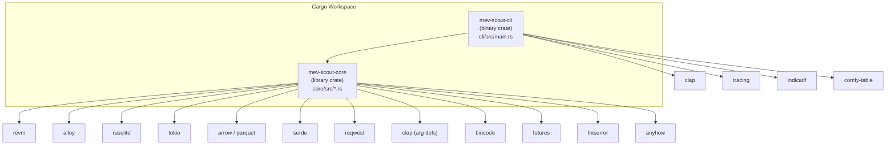
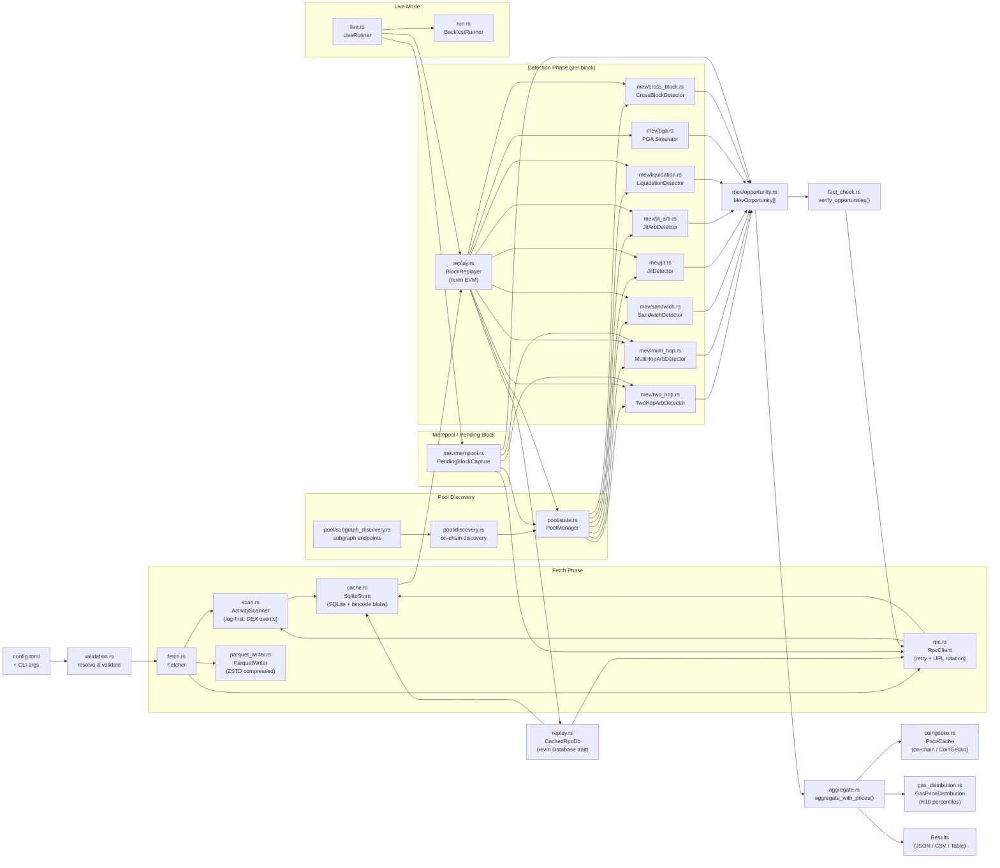
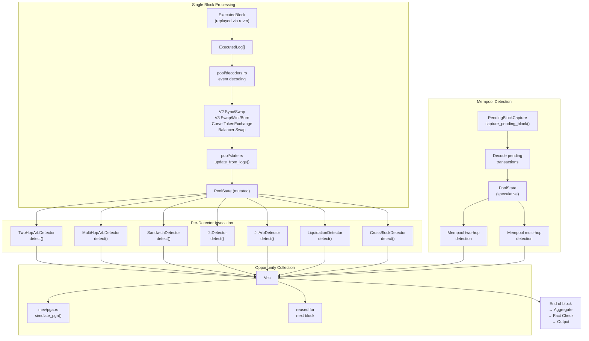
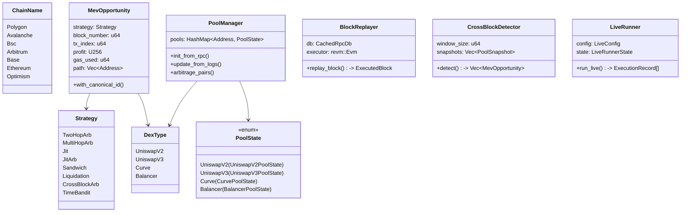
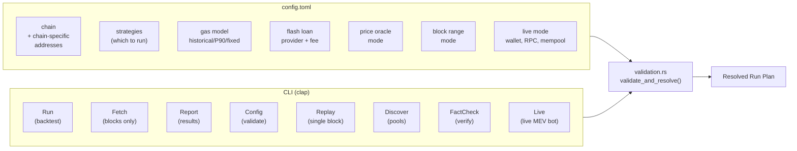
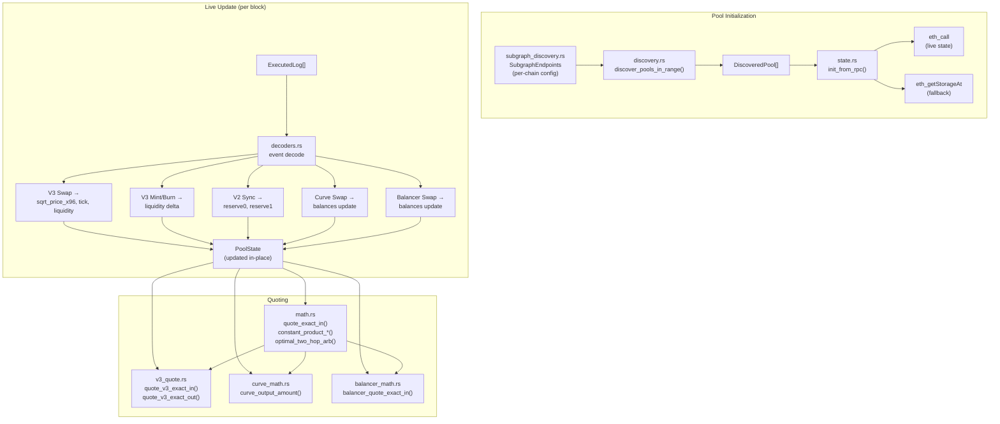

# MEV Scout — Codebase Architecture

## 1. Crate Dependency Graph

## 2. End-to-End Data Pipeline

## 3. Core Module Hierarchy

```mermaid
flowchart TB
    subgraph core["core/"]
        types["types.rs\nChainName, Strategy,\nGasConfig, OutputFormat"]
        config["config.rs\nConfig, ChainConfig,\nCliOverrides"]
        cli_def["cli.rs\nCli, Command"]
        validation["validation.rs\nValidationResult"]
        data["data.rs\nBlockData, TxData,\nReceiptData, LogData"]
        utils["utils.rs\nu128_from_be_bytes"]
        gas_dist["gas_distribution.rs\nGasPriceDistribution"]
        live["live.rs\nLiveRunner, LiveConfig"]

        subgraph infra["Infrastructure"]
            rpc["rpc.rs\nRpcClient"]
            cache["cache.rs\nSqliteStore"]
            parquet["parquet_writer.rs\nParquetWriter"]
            scan["scan.rs\nActivityScanner"]
            resolver["resolver.rs\nRangeResolver"]
        end

        subgraph pool["Pool Management"]
            state["state.rs\nPoolManager, PoolState\nV2/V3/Curve/Balancer"]
            math["math.rs\nAMM formulas,\noptimal arb amounts"]
            v3_quote["v3_quote.rs\nV3 exact-in/out\nquoting"]
            decoders["decoders.rs\nEvent log decoders"]
            discovery["discovery.rs\nPool discovery"]
            subgraph_disc["subgraph_discovery.rs\nSubgraphEndpoint config"]
            curve_math["curve_math.rs\nCurve AMM formulas"]
            balancer_math["balancer_math.rs\nBalancer AMM formulas"]
            dex_type["dex_type.rs\nDexType enum"]
        end

        subgraph mev["MEV Detection"]
            two_hop["two_hop.rs\nTwo-hop arbitrage"]
            multi_hop["multi_hop.rs\nMulti-hop arbitrage"]
            sandwich["sandwich.rs\nSandwich detection"]
            jit["jit.rs\nJIT liquidity"]
            jit_arb["jit_arb.rs\nJIT arbitrage"]
            liquidation["liquidation.rs\nAave V3 liquidation"]
            pga["pga.rs\nPGA simulation"]
            block_builder["block_builder.rs\nBundle packing"]
            opportunity["opportunity.rs\nMevOpportunity"]
            cross_block["cross_block.rs\nCross-block arb\n+ time-bandit"]
            mempool["mempool.rs\nPending block capture\n+ mempool arb detection"]
        end

        replay["replay.rs\nBlockReplayer"]
        fetch["fetch.rs\nFetcher"]
        run["run.rs\nBacktestRunner"]
        aggregate["aggregate.rs\nAggregation"]
        fact_check["fact_check.rs\nVerification"]
        coingecko["coingecko.rs\nPrice oracle"]
    end

    subgraph cli_app["cli/"]
        main["main.rs\nEntry point,\n8 subcommands"]
    end

    main --> run
    main --> fetch
    main --> fact_check
    main --> live
    run --> state
    run --> replay
    run --> two_hop
    run --> multi_hop
    run --> sandwich
    run --> jit
    run --> jit_arb
    run --> liquidation
    run --> pga
    run --> cross_block
    run --> mempool
    run --> discovery
    run --> resolver
    run --> rpc
    run --> cache
    run --> gas_dist
    run --> opportunity

    fetch --> cache
    fetch --> scan
    fetch --> rpc
    fetch --> resolver
    fetch --> parquet

    replay --> cache
    replay --> rpc
    replay --> data

    live --> run
    live --> mempool
    live --> rpc
    live --> cache
    live --> replay

    state --> rpc
    state --> decoders
    state --> dex_type
    state --> utils
    state --> data

    math --> state
    math --> v3_quote
    math --> curve_math
    math --> balancer_math

    discovery --> cache
    discovery --> dex_type
    discovery --> rpc
    discovery --> scan

    subgraph_disc --> dex_type
    subgraph_disc --> discovery

    curve_math --> state
    balancer_math --> state

    two_hop --> state
    two_hop --> math
    two_hop --> v3_quote
    two_hop --> opportunity

    multi_hop --> state
    multi_hop --> math
    multi_hop --> v3_quote
    multi_hop --> opportunity

    sandwich --> state
    sandwich --> math
    sandwich --> v3_quote
    sandwich --> opportunity
    sandwich --> data
    sandwich --> decoders
    sandwich --> utils

    jit --> state
    jit --> v3_quote
    jit --> opportunity
    jit --> data
    jit --> decoders

    jit_arb --> state
    jit_arb --> math
    jit_arb --> v3_quote
    jit_arb --> opportunity
    jit_arb --> data
    jit_arb --> decoders

    liquidation --> state
    liquidation --> opportunity
    liquidation --> rpc
    liquidation --> data

    cross_block --> opportunity
    cross_block --> state
    cross_block --> types

    mempool --> state
    mempool --> math
    mempool --> rpc
    mempool --> two_hop
    mempool --> multi_hop
    mempool --> opportunity
    mempool --> data
    mempool --> utils

    aggregate --> opportunity
    aggregate --> coingecko

    fact_check --> rpc
    fact_check --> state
    fact_check --> v3_quote
    fact_check --> math
    fact_check --> opportunity
```

## 4. MEV Detection Strategy Flow

## 5. Key Data Types

## 6. Configuration & CLI Structure

## 7. Pool Management Detail

## File Size Overview

| File | Lines | Module | Purpose |
|---|---|---|---|
| `pool/state.rs` | ~2,255 | Core | Pool manager + all pool state structs |
| `integration.rs` | ~1,324 | Tests | Integration tests |
| `fact_check.rs` | ~1,225 | Core | On-chain opportunity verification |
| `replay.rs` | ~1,176 | Core | EVM block replayer + CachedRpcDb |
| `cache.rs` | ~1,151 | Core | SQLite-backed block/state cache |
| `pool/v3_quote.rs` | ~1,031 | Pool | Uniswap V3 quoting engine |
| `config.rs` | ~990 | Core | Config struct, chain configs, CLI overrides |
| `rpc.rs` | ~982 | Infra | Multi-provider RPC client + rate limiter |
| `liquidation.rs` | ~930 | MEV | Aave V3 liquidation detection |
| `types.rs` | ~915 | Core | ChainName, Strategy, GasConfig, etc. |
| `two_hop.rs` | ~806 | MEV | Two-hop arbitrage detection |
| `sandwich.rs` | ~791 | MEV | Sandwich attack detection |
| `run.rs` | ~667 | Core | BacktestRunner orchestration |
| `pool/discovery.rs` | ~659 | Pool | Pool discovery |
| `live.rs` | ~646 | Core | Live MEV bot runner |
| `jit_arb.rs` | ~617 | MEV | JIT arbitrage detection |
| `jit.rs` | ~605 | MEV | JIT liquidity detection |
| `aggregate.rs` | ~580 | Core | USD aggregation + metrics |
| `pool/subgraph_discovery.rs` | ~572 | Pool | Subgraph endpoint configuration |
| `pool/math.rs` | ~545 | Pool | AMM math + unified quote_exact_in |
| `mev/mempool.rs` | ~538 | MEV | Pending block capture + mempool arb |
| `parquet_writer.rs` | ~510 | Infra | Parquet (ZSTD) block data writer |
| `validation.rs` | ~506 | Core | Config validation + resolution |
| `multi_hop.rs` | ~487 | MEV | Multi-hop arbitrage detection |
| `fetch.rs` | ~423 | Core | Fetcher — block data fetching |
| `mev/opportunity.rs` | ~400 | MEV | MevOpportunity struct + ResultsFile |
| `pool/decoders.rs` | ~395 | Pool | Event log decoders |
| `pool/curve_math.rs` | ~355 | Pool | Curve AMM math (StableSwap + CryptoSwap) |
| `coingecko.rs` | ~319 | Core | CoinGecko USD pricing with cache |
| `data.rs` | ~287 | Core | Wire-format data types |
| `cli.rs` | ~282 | Core | CLI argument parsing (clap) |
| `mev/cross_block.rs` | ~252 | MEV | Cross-block MEV detection |
| `pool/balancer_math.rs` | ~249 | Pool | Balancer AMM math |
| `mev/block_builder.rs` | ~217 | MEV | Bundle packing into blocks |
| `gas_distribution.rs` | ~183 | Core | Gas price distribution |
| `resolver.rs` | ~180 | Infra | Block range resolution |
| `scan.rs` | ~145 | Infra | DEX activity scanner |
| `mev/pga.rs` | ~141 | MEV | PGA simulation |
| `utils.rs` | ~46 | Core | u128_from_be_bytes utility |
| `pool/dex_type.rs` | ~31 | Pool | DexType enum |
| `main.rs` | ~1,520 | CLI | CLI entry point |
| `e2e.rs` | ~492 | Tests | End-to-end tests |
