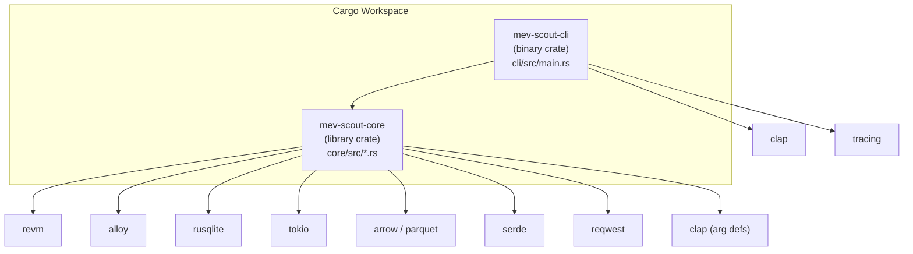
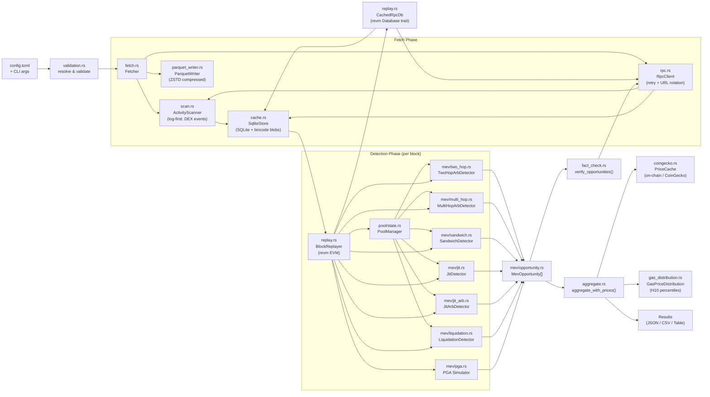
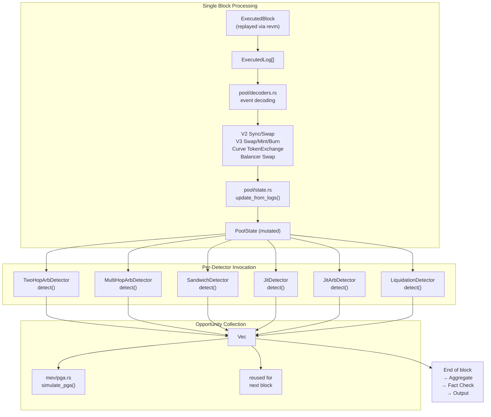
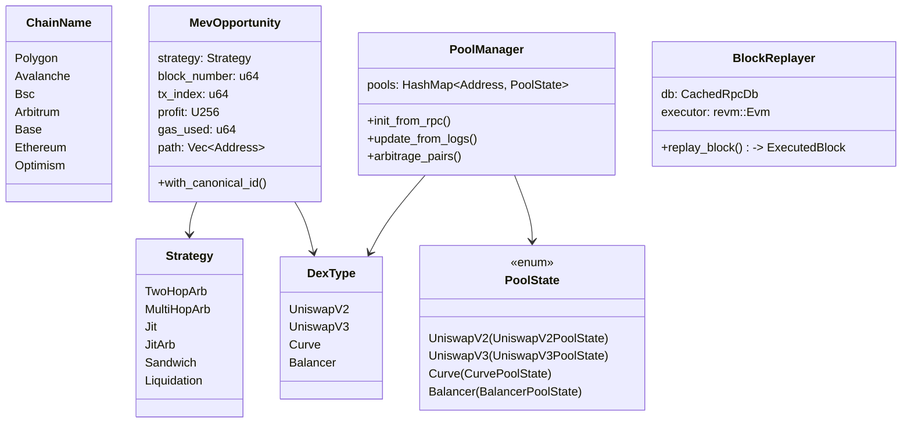
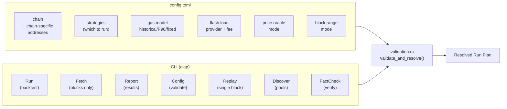
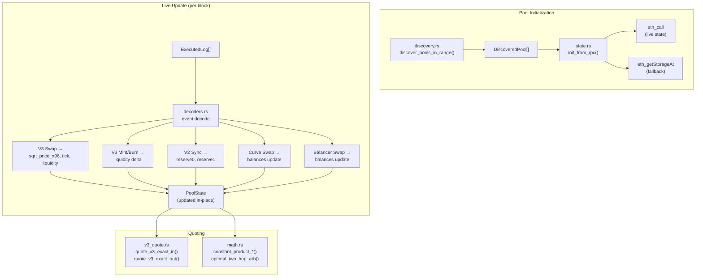

# MEV Scout — Codebase Architecture

## 1. Crate Dependency Graph

## 2. End-to-End Data Pipeline

## 3. Core Module Hierarchy

```mermaid
flowchart TB
    subgraph core["core/"]
        types["types.rs\nChainName, Strategy,\nGasConfig, OutputFormat"]
        config["config.rs\nConfig, ChainConfig,\nCliOverrides"]
        cli_def["cli.rs\nCli, Command"]
        validation["validation.rs\nValidationResult"]
        data["data.rs\nBlockData, TxData,\nReceiptData, LogData"]
        utils["utils.rs\nu128_from_be_bytes"]
        gas_dist["gas_distribution.rs\nGasPriceDistribution"]

        subgraph infra["Infrastructure"]
            rpc["rpc.rs\nRpcClient"]
            cache["cache.rs\nSqliteStore"]
            parquet["parquet_writer.rs\nParquetWriter"]
            scan["scan.rs\nActivityScanner"]
            resolver["resolver.rs\nRangeResolver"]
        end

        subgraph pool["Pool Management"]
            state["state.rs\nPoolManager, PoolState\nV2/V3/Curve/Balancer"]
            math["math.rs\nAMM formulas,\noptimal arb amounts"]
            v3_quote["v3_quote.rs\nV3 exact-in/out\nquoting"]
            decoders["decoders.rs\nEvent log decoders"]
            discovery["discovery.rs\nPool discovery"]
            dex_type["dex_type.rs\nDexType enum"]
        end

        subgraph mev["MEV Detection"]
            two_hop["two_hop.rs\nTwo-hop arbitrage"]
            multi_hop["multi_hop.rs\nMulti-hop arbitrage"]
            sandwich["sandwich.rs\nSandwich detection"]
            jit["jit.rs\nJIT liquidity"]
            jit_arb["jit_arb.rs\nJIT arbitrage"]
            liquidation["liquidation.rs\nAave V3 liquidation"]
            pga["pga.rs\nPGA simulation"]
            block_builder["block_builder.rs\nBundle packing"]
            opportunity["opportunity.rs\nMevOpportunity"]
        end

        replay["replay.rs\nBlockReplayer"]
        fetch["fetch.rs\nFetcher"]
        run["run.rs\nBacktestRunner"]
        aggregate["aggregate.rs\nAggregation"]
        fact_check["fact_check.rs\nVerification"]
        coingecko["coingecko.rs\nPrice oracle"]
    end

    subgraph cli_app["cli/"]
        main["main.rs\nEntry point,\n7 subcommands"]
    end

    main --> run
    main --> fetch
    main --> fact_check
    run --> state
    run --> replay
    run --> two_hop
    run --> multi_hop
    run --> sandwich
    run --> jit
    run --> jit_arb
    run --> liquidation
    run --> pga
    run --> discovery
    run --> resolver
    run --> rpc
    run --> cache
    run --> gas_dist
    run --> opportunity

    fetch --> cache
    fetch --> scan
    fetch --> rpc
    fetch --> resolver
    fetch --> parquet

    replay --> cache
    replay --> rpc
    replay --> data

    state --> rpc
    state --> decoders
    state --> dex_type
    state --> utils

    two_hop --> state
    two_hop --> math
    two_hop --> v3_quote
    two_hop --> opportunity

    multi_hop --> state
    multi_hop --> math
    multi_hop --> v3_quote
    multi_hop --> opportunity

    aggregate --> opportunity
    aggregate --> coingecko

    fact_check --> rpc
    fact_check --> state
    fact_check --> v3_quote
    fact_check --> math
    fact_check --> opportunity
```

## 4. MEV Detection Strategy Flow

## 5. Key Data Types

## 6. Configuration & CLI Structure

## 7. Pool Management Detail

## File Size Overview

| File | Lines | Module | Purpose |
|---|---|---|---|
| `pool/state.rs` | ~2,215 | Core | Pool manager + all pool state structs |
| `replay.rs` | ~1,344 | Core | EVM block replayer + CachedRpcDb |
| `fact_check.rs` | ~1,327 | Core | On-chain opportunity verification |
| `v3_quote.rs` | ~1,088 | Core | Uniswap V3 quoting engine |
| `integration.rs` | ~1,041 | Tests | Integration tests |
| `liquidation.rs` | ~903 | MEV | Aave V3 liquidation detection |
| `two_hop.rs` | ~951 | MEV | Two-hop arbitrage detection |
| `jit_arb.rs` | ~627 | MEV | JIT arbitrage detection |
| `jit.rs` | ~598 | MEV | JIT liquidity detection |
| `sandwich.rs` | ~680 | MEV | Sandwich attack detection |
| `aggregate.rs` | ~571 | Core | USD aggregation + metrics |
| `discovery.rs` | ~569 | Pool | Pool discovery |
| `multi_hop.rs` | ~489 | MEV | Multi-hop arbitrage |
| `math.rs` | ~472 | Pool | AMM math formulas |
| `decoders.rs` | ~395 | Pool | Event log decoders |
| `main.rs` | ~1,800 | CLI | CLI entry point |
