# mev-scout — Architecture & CLI Command Guide

An MEV opportunity scanner & backtester for EVM chains (primary target: Polygon).
Three host crates on one engine, plus a SPA frontend:

- **`core/`** — `mev-scout-core`: engine + stores + shared job orchestration.
- **`cli/`** — `mev-scout-cli`: thin binary (`mev-scout`) with 11 subcommands. Parses args, loads config, presentation, dispatches to core.
- **`api/`** — `mev-scout-api`: local-only HTTP API (`127.0.0.1`); jobs call core in-process (no CLI subprocess); serves `web/dist`.
- **`web/`** — Vite + React SPA: Dashboard, Run, Live, Explorer, Pools, Jobs, Results, Config.

---

## 1. Top-down module view

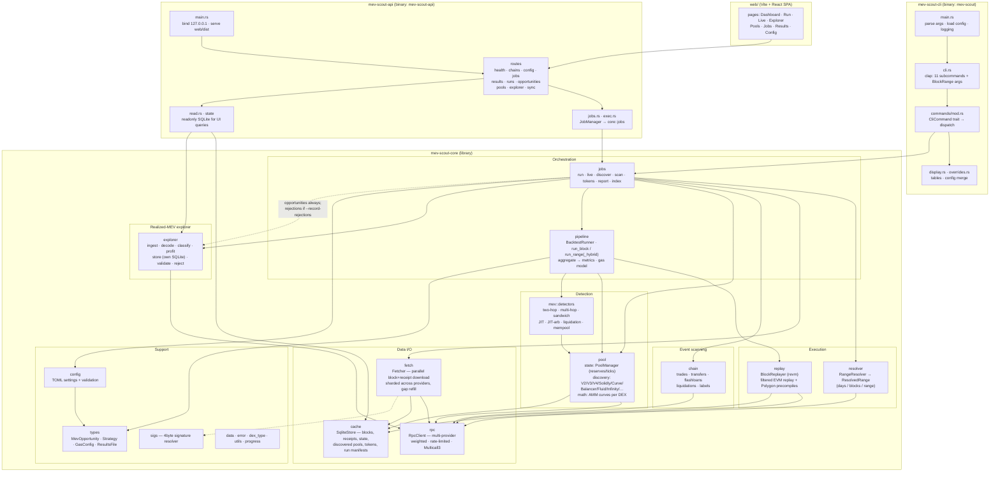

**Key relationships**

- Both `CLI` and `API` are first-class hosts: `CLI → core` and `web → API → core`. Shared long-running flows live in `core::jobs`.
- `pipeline` is the hub: `BacktestRunner` owns `BlockReplayer` + `PoolManager` and drives every detector per transaction.
- `cache` (SQLite) is the local-first backbone — fetch stores blocks there; replay and the runner read from it; pool discovery persists pools/tokens into it.
- `rpc` fronts the chain for everything: fetching, `eth_call` pool state, log scans, and replay's on-demand state misses (via `CachedRpcDb`).
- `explorer` answers "what was made" (realized MEV forensics) vs the detectors' "what could be made" — it ingests via RPC into its own SQLite store (`explorer_{chain}.sqlite`) so backfill writes never contend with replay-path cache reads. Scanner `run`/`live` always persist detected opportunities there (via in-memory `ResultsFile` DTO); `--record-rejections` also stores rejected candidates for miss attribution.
- The API never shells out to the CLI binary: `JobManager` + `exec` parse argv-style flags and call the same `core::jobs::*` entry points the CLI uses.

---

## 2. API & web UI

Local-only server (`mev-scout-api`, default `http://127.0.0.1:7600`). Serves the built SPA from `web/dist` with SPA fallback for client routes; Vite dev (`:5173`) can hit the API via CORS.

### Job surface (write / long-running)

`POST /api/jobs` allowlist (CLI-only stay off this list: `fetch`, `replay`, `config`, `validate-pools`, most `explorer` query subcommands):

| Command | Notes |
|---|---|
| `run` | Full backtest |
| `live` | One-shot or looping detection |
| `discover` | Pool universe build |
| `tokens` | Token metadata cache |
| `scan` | Raw event scans |
| `report` | Re-render a recorded run |
| `explorer index` | Realized-MEV backfill / live index |

Job lifecycle: create → poll `/api/jobs/:id` · `/progress` · `/log` → optional `/stop`. Execution is in-process on a worker thread (`exec::run_job` → `core::jobs`).

### Read surface (SQLite → JSON)

| Route group | Source | Purpose |
|---|---|---|
| `/api/health`, `/api/chains` | process + config | liveness, configured chains |
| `/api/config` | TOML (GET/PUT) | view / edit resolved config |
| `/api/runs`, `/api/pools` | cache DB | run manifests, discovered pools |
| `/api/results`, `/api/opportunities` | explorer DB | run detail, PnL, validation, opp lists |
| `/api/explorer/*` | explorer DB | feed, stats, overview, top, ops, op detail |
| `/api/sync` | explorer sync_state | indexer checkpoint / lag |

### SPA pages (`web/src/pages`)

Dashboard · RunBacktest · Live · Explorer · Pools · Jobs · Results · Config — all talk to the routes above (poll jobs; read SQLite-backed JSON).

---

## 3. CLI command map

| Command | Purpose | Chain access | Writes |
|---|---|---|---|
| `run` | Full backtest → opportunities | yes (fetch + eth_call) | SQLite cache, explorer SQLite |
| `live` | Stream new blocks, detect as they arrive | yes | SQLite cache, explorer SQLite |
| `fetch` | Pre-cache blocks only (no detection) | yes | SQLite cache |
| `discover` | Find pools (on-chain factories / aggregators) | yes (RPC and/or REST) | SQLite cache |
| `validate-pools` | Measure discovery accuracy vs GeckoTerminal | yes (RPC + REST) | SQLite cache |
| `tokens` | Populate / view token metadata cache | optional REST (`--enrich`) | SQLite `token_symbols` |
| `scan` | Raw event scans (trades/whales/flashloans/liqs) | yes (getLogs only) | — |
| `replay` | Debug a single block through revm | yes (fallback calls) | — |
| `report` | Re-render a recorded run from SQLite | no | — |
| `config` | Print fully-resolved TOML | no | — |
| `explorer` | Realized-MEV forensics (index/feed/stats/top/show/explain/validate/export) | yes (logs; optional traces) | Explorer SQLite store |

---

## 4. Command workflows (per command)

### 4.1 `run` — the full backtest

The main pipeline. Everything is cached first, then replayed and detected.

```
mev-scout run --days 7 [--batch-rpc] [--record-rejections]
```

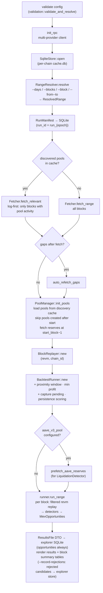

Inside `run_range` — per block:

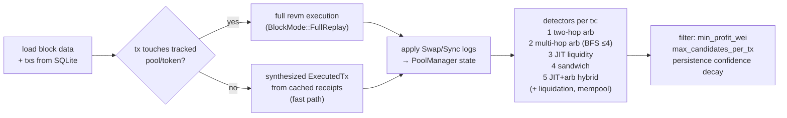

### 4.2 `live` — real-time streaming detection

Same engine, one-shot or continuous polling (`--loop [--duration 1h] [--poll-interval-ms 2000]`); `--record-rejections` persists rejected candidates to the explorer store.

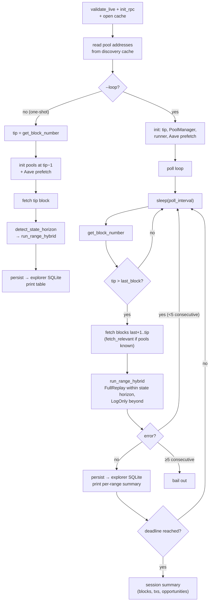

### 4.3 `fetch` — pre-cache blocks only

Warms the SQLite cache so later `run`/`replay` are fast/offline-friendly.

```
mev-scout fetch --blocks 1000 [--batch-rpc] [--no-sig-resolve]
```

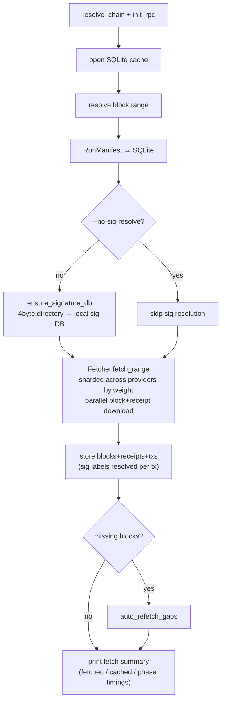

### 4.4 `discover` — build the pool universe

Finds pools from factory events and/or free aggregators; result feeds all other commands (they read the discovery cache).

```
mev-scout discover --days 30 [--source onchain|remote|hybrid] [--enrich] [--incremental]
```

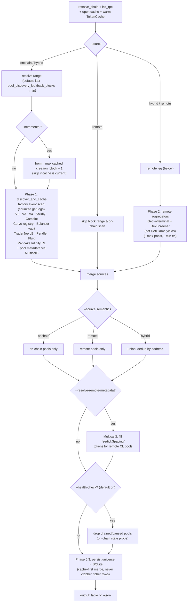

### 4.5 `validate-pools` — discovery accuracy audit

Compares our on-chain discovery (set A) against GeckoTerminal references (set B).

```
mev-scout validate-pools --days 7 [--source all|gecko] [--json] [--markdown-out report.md]
```

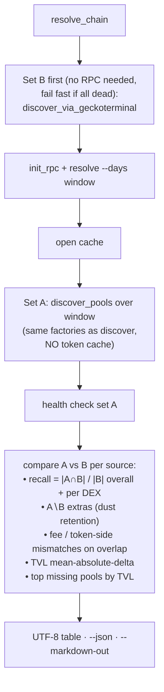

### 4.6 `tokens` — token metadata cache

Offline by default (bundled known-token list + SQLite). Optional `--enrich`
pulls missing **symbol/decimals** from DefiLlama coins and **name/icon URL**
from CoinGecko's contract endpoint. DefiLlama yields is **not** used for
pool discovery (UUID-only; no pool contract addresses).

```
mev-scout tokens [--symbol USDC] [--decimals 6] [--limit 100] [--cache-only] [--enrich]
```

```mermaid
flowchart LR
    A["resolve chain → chain_id"] --> B["open SQLite cache"]
    B --> C["TokenCache::warm(chain_id)<br/>bundled known tokens"]
    C --> D["merge persisted tokens<br/>from SQLite"]
    D --> E{"--enrich?"}
    E -- yes --> F["seed addresses from pool_info"]
    F --> G["DefiLlama coins<br/>symbol / decimals"]
    G --> H["CoinGecko contract<br/>name / icon_url (capped)"]
    H --> I["persist_all → SQLite"]
    I --> J
    E -- no --> J["filter by --symbol / --decimals"]
    J --> K["sort by address, truncate --limit"]
    K --> L{"--cache-only?"}
    L -- yes --> M["print count only"]
    L -- no --> N["table / json / csv"]
```

### 4.7 `scan` — raw on-chain event scans

Topic-level `eth_getLogs` scans; replaces the old Dune-query workflows. No cache writes.

```
mev-scout scan --kind trades|transfers|flashloans|liquidations|labels [--address 0x..] [--limit 500]
```

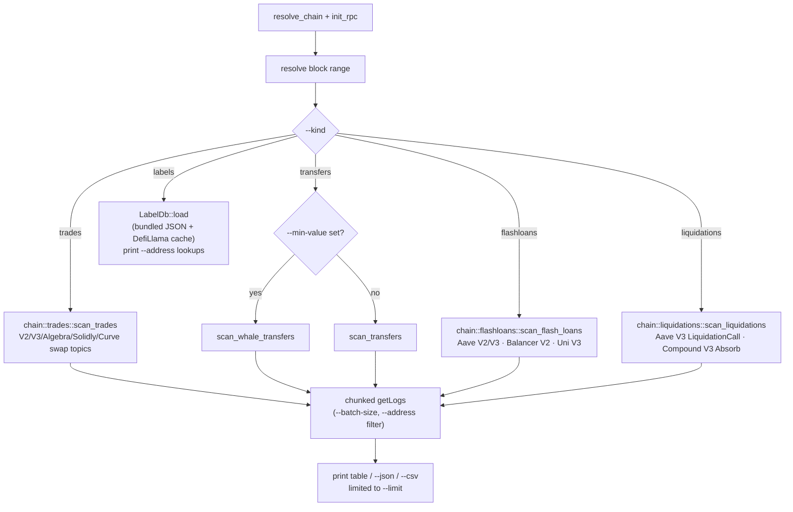

### 4.8 `replay` — single-block EVM debugger

Re-runs one cached block through revm and verifies results against cached receipts.

```
mev-scout replay --block 65000000 [--tx-index 42] [--analyze]
```

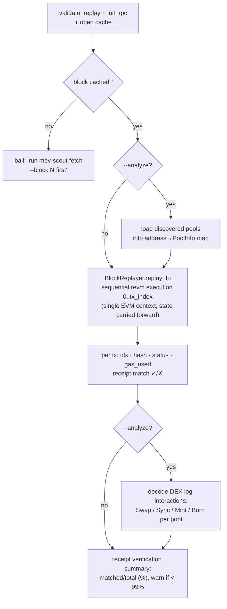

### 4.9 `report` — re-render saved results

Offline. Reads run history from the SQLite stores — the `run_manifests` table (cache DB) for run metadata and the `opportunities` table (explorer DB) — and re-renders them. No chain access; no JSON result files on disk.

```
mev-scout report [--run-id run_1717...]
```

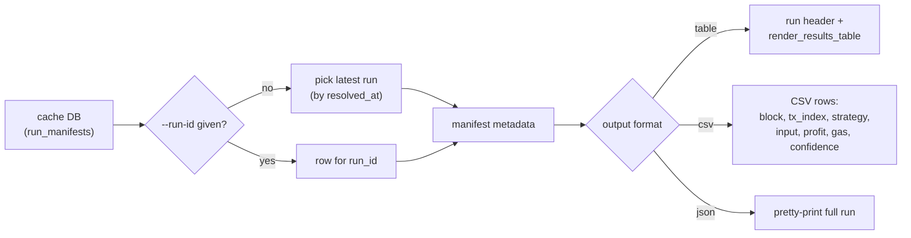

### 4.10 `config` — print resolved config

Offline, two lines of logic: merges TOML file (if any) with CLI overrides in `main.rs`, then serializes.

```
mev-scout config [-f custom.toml] [--verbose]
```

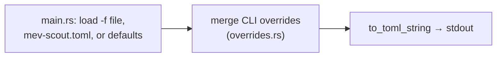

### 4.11 `explorer` — realized-MEV forensics

Forensic reconstruction of MEV that was actually extracted on-chain — the counterpart to the scanner's simulated opportunities. Pipeline: `ingest` (block+receipt fetch, reorg-aware, resumable) → `decode` (swaps, transfers, liquidation facts) → `classify` (per-block pattern passes) → `profit` (token balance-delta accounting, gas, USD) → `store` (dedicated SQLite, `explorer_{chain}.sqlite`) → query surface below. Scanner `run`/`live` persist opportunities into the same store (via `ResultsFile` as an in-memory DTO); `--record-rejections` adds rejected candidates for cross-validation and miss-cause attribution.

```
mev-scout explorer doctor
mev-scout explorer index [--from N --to N | --days N] [--live [--duration DURATION]]
mev-scout explorer live-feed [--kinds KINDS] [--min-profit-usd USD] [--duration DURATION]
mev-scout explorer stats [--since 1d|7d|30d|all] [--kind KIND]
mev-scout explorer top --by sender|token|pool --metric profit|ops [--since WINDOW]
mev-scout explorer show <TX_HASH> [--trace]
mev-scout explorer explain <TX_HASH>
mev-scout explorer validate [--since WINDOW] [--match-window N] [--threshold-sweep]
mev-scout explorer export --format json|csv [--out FILE]
```

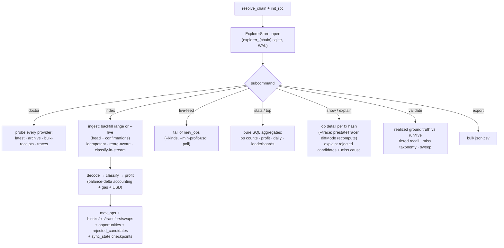

#### Classifier-change replay recipe (wipe + reindex)

Any change to `decode` / `classify` / P&L invalidates existing `mev_ops` rows for
the affected window, so before/after Phase numbers are only comparable after a
replay. `index` is replay-safe (INSERT OR REPLACE, reorg-aware, idempotent), so
the wipe is required only for classifier *semantics* changes, not plain re-indexes:

```bash
# 1) Wipe the affected window on the forensic DB (example: Polygon, from N).
#    Remove classified ops + classified-block markers and rewind the checkpoint.
sqlite3 explorer_polygon.sqlite \
  "DELETE FROM mev_ops       WHERE block_number >= N;
   DELETE FROM blocks_classified WHERE block >= N;
   UPDATE sync_state SET indexed_to = N-1 WHERE chain_id = 137;"

# 2) Reclassify from stored facts.
mev-scout explorer index --from N --to M   # or --days D after the wipe above

# 3) Re-run baseline validation + missing-pool report.
mev-scout explorer validate --threshold-sweep --emit-missing-pools
```

#### Phase-0 baseline recipe and ship gates

Fixed-window recipe (e.g. Polygon, last 7 days):

```bash
mev-scout explorer index --days 7
mev-scout explorer validate --threshold-sweep --emit-missing-pools
```

Record the report on every phase merge (`cargo test` + clippy alone are not the
gate). Numbers are data-dependent — tests assert report *shape* only:

| Window | recall | USD-recall | miss-taxonomy | profit-error MAD | `arb_likely` parity |
|---|---|---|---|---|---|
| *(pending — run recipe above with RPC)* | — | — | — | — | `true` (default) |

No working RPC credentials were available to fill real numbers: the avalanche
endpoint committed in `mev-scout.toml` is revoked (connection reset; `explorer
doctor` reports `latest=✗ archive=n/a traces=n/a`, Gate FAIL). Re-run the
recipe locally with a valid key (plain URL or `${ENV_VAR}` placeholder) and
paste validate output into the table before flipping `arb_likely_parity` or
enabling causal kinds in live-feed defaults.

Gates that depend on this table:
- **Phase 1.2**: flip `explorer.arb_likely_parity=false` only when USD-recall drop
  ≤ the agreed budget recorded here (or an explicit "precision over recall"
  decision is written next to the numbers). No blind cliffs.
- **Phase 3 ship gate**: labeled golden set (Phase 0.5) must show acceptable
  backrun/frontrun precision before those kinds are enabled in live-feed defaults.
  Synthetic CI set: `mev-scout explorer validate --golden-causal` (or
  `cargo test -p mev-scout-core golden`). Live-feed / API feed default **excludes**
  `frontrun`/`backrun`; pass `--kinds all` (or include them explicitly) to opt in.
  Chain-curated labels remain a follow-up once an RPC baseline window is available.

#### Known biases / methodology notes

| Bias | Status | Notes |
|---|---|---|
| Historical `arb_likely` catch-all | Active (`arb_likely_parity=true` default) | Single-hop / non-cycle profitable residuals still label `arb_atomic` until the Phase-0 window gate flips the default. |
| Logs-only Backrun / Frontrun | By design | Execution-price proxies ≠ REVM `profit(B\|before_A)` vs `profit(B\|after_A)`. `STATE_DELTA_MATCH` / `PROFIT_VERIFIED` are **not** REVM-verified. |
| Gas | Mitigated (Phase 2.1) | Prefer receipt `effectiveGasPrice`, then legacy `gasPrice`; only fall back to `base_fee + priority`. |
| Multi-token profit | Mitigated (Phase 2.3) | Persist sums USD across all positive residuals; `profit_token` remains display-primary. JIT fee-capture stays unit-reported (`profit_token=None`). |
| Hourly pricing / FOT | Partial | Hourly token prices at persist; FOT/rebase tokens flagged `usd_approximate` in details. Long-tail decimals via Multicall3; realized-rate fallback for unpriced residuals. |
| Uni V3 `Flash` | Deferred | Not netted as Aave-style flash loan (different callback repay semantics). |
| Sandwich contract mediation | Logs-only | `tx.to` on front/back tags `contract_mediated`; store-backed labeled-searcher registry not required. |
| JIT cross-block reorg | Known limitation | Exact-key + `>=` liquidity close; cannot restore a position whose Burn is unwound by a reorg. |

---

## 5. The engine core: how detection works

`BacktestRunner.run_block` (pipeline/runner.rs) is the heart of `run` and `live`:

1. **Load** block + txs from SQLite.
2. **Filter** — only txs whose `to` or log emitter matches a tracked pool/token are replayed through revm; all others are synthesized from cached receipts (the main performance optimization for large backtests).
3. **Apply** decoded Swap/Sync/Mint/Burn events to `PoolManager`, so all detectors see post-tx reserves.
4. **Detect** per tx, in order: two-hop arb → multi-hop arb (BFS ≤ depth 4) → JIT liquidity → sandwich → JIT+arb hybrid; liquidation and mempool strategies where context allows.
5. **Post-process** — dust filter (`min_profit_wei`), per-tx candidate cap, cross-block persistence scoring (decaying confidence, `PERSISTENCE_DECAY = 0.75`, grace 5 blocks), gas calibration from observed `gasUsed`.

The hybrid path (`run_range_hybrid`, used by `live`) picks `FullReplay` vs `LogOnly` per block based on `rpc.detect_state_horizon` — blocks deeper than available archive state skip EVM execution and lose only the EVM-context strategies.

## 6. Persistent artifacts

| Artifact | Produced by | Consumed by |
|---|---|---|
| SQLite `cache.db` (blocks, receipts, state, discovered pools, tokens, run manifests) | `run`, `live`, `fetch`, `discover`, `validate-pools` | `run`, `live`, `replay`, `discover` (incremental), `tokens`, `report` (manifests), API read routes |
| Explorer store `explorer_{chain}.sqlite` — `opportunities` (+ optional `rejected_candidates`) | `run`, `live` (always opportunities; rejections with `--record-rejections`) | `report`, API `/api/results` · `/api/opportunities`, `explorer explain` / `validate` |
| Explorer store `explorer_{chain}.sqlite` — forensic layer (blocks, txs, transfers, swaps, `mev_ops`, sync_state, …) | `explorer index` | `explorer` CLI + API `/api/explorer/*` |
| Signature DB (4byte directory snapshot) | `fetch` (unless `--no-sig-resolve`) | tx decoding |
| `api_data/` job logs | API `JobManager` | `/api/jobs/:id/log` |

`ResultsFile` is an in-memory / presentation DTO (CLI tables, API job outcomes) — not a durable on-disk JSON artifact.
