# mev-scout — Architecture & CLI Command Guide

An MEV opportunity scanner & backtester for EVM chains (primary target: Polygon).
Two crates:

- **`core/`** — `mev-scout-core`: all engine logic (fetching, replay, detection, caching).
- **`cli/`** — `mev-scout-cli`: thin binary (`mev-scout`) with 10 subcommands. Parses args, loads config, dispatches to core.

---

## 1. Top-down module view

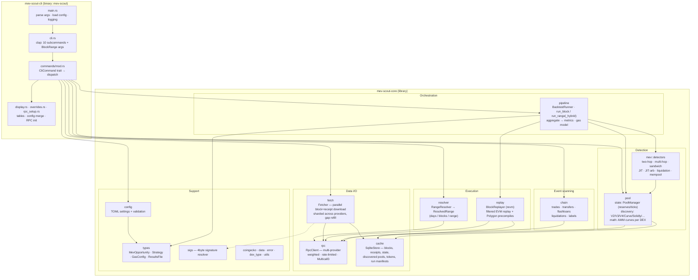

**Key relationships**

- `pipeline` is the hub: `BacktestRunner` owns `BlockReplayer` + `PoolManager` and drives every detector per transaction.
- `cache` (SQLite) is the local-first backbone — fetch stores blocks there; replay and the runner read from it; pool discovery persists pools/tokens into it.
- `rpc` fronts the chain for everything: fetching, `eth_call` pool state, log scans, and replay's on-demand state misses (via `CachedRpcDb`).

---

## 2. CLI command map

| Command | Purpose | Chain access | Writes |
|---|---|---|---|
| `run` | Full backtest → opportunities | yes (fetch + eth_call) | SQLite cache, results JSON |
| `live` | Stream new blocks, detect as they arrive | yes | SQLite cache, results JSON |
| `fetch` | Pre-cache blocks only (no detection) | yes | SQLite cache |
| `discover` | Find pools (on-chain factories / aggregators) | yes (RPC and/or REST) | SQLite cache |
| `validate-pools` | Measure discovery accuracy vs GeckoTerminal | yes (RPC + REST) | SQLite cache |
| `tokens` | Populate / view token metadata cache | no (cache-only) | — (reads cache) |
| `scan` | Raw event scans (trades/whales/flashloans/liqs) | yes (getLogs only) | — |
| `replay` | Debug a single block through revm | yes (fallback calls) | — |
| `report` | Re-render a saved run's JSON | no | — |
| `config` | Print fully-resolved TOML | no | — |

---

## 3. Command workflows (per command)

### 3.1 `run` — the full backtest

The main pipeline. Everything is cached first, then replayed and detected.

```
mev-scout run --days 7 [--batch-rpc]
```

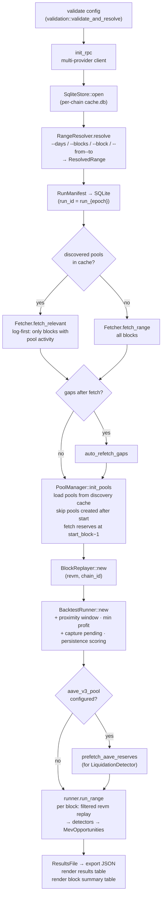

Inside `run_range` — per block:

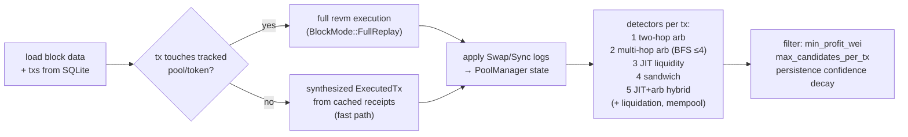

### 3.2 `live` — real-time streaming detection

Same engine, one-shot or continuous polling (`--loop [--duration 1h] [--poll-interval-ms 2000]`).

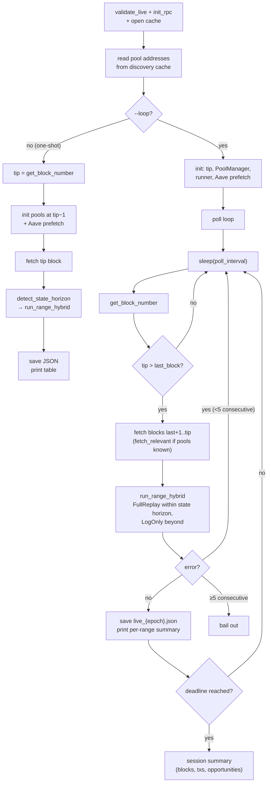

### 3.3 `fetch` — pre-cache blocks only

Warms the SQLite cache so later `run`/`replay` are fast/offline-friendly.

```
mev-scout fetch --blocks 1000 [--batch-rpc] [--no-sig-resolve]
```

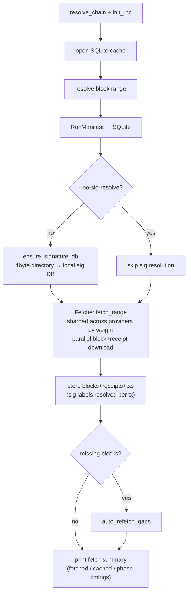

### 3.4 `discover` — build the pool universe

Finds pools from factory events and/or free aggregators; result feeds all other commands (they read the discovery cache).

```
mev-scout discover --days 30 [--source onchain|remote|hybrid] [--enrich] [--incremental]
```

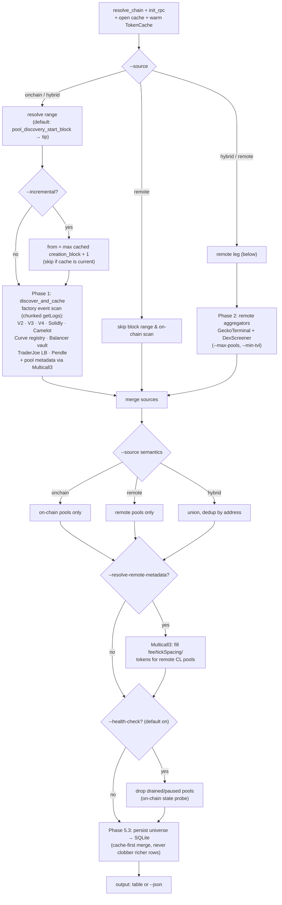

### 3.5 `validate-pools` — discovery accuracy audit

Compares our on-chain discovery (set A) against GeckoTerminal references (set B).

```
mev-scout validate-pools --days 7 [--source all|gecko] [--json] [--markdown-out report.md]
```

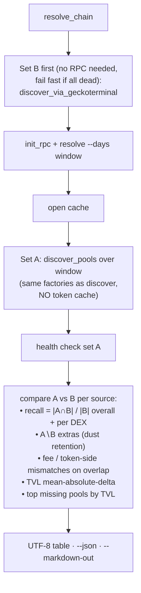

### 3.6 `tokens` — token metadata cache

Cache-only command; resolves nothing new on-chain at runtime (the bundled known-token list + previously resolved symbols).

```
mev-scout tokens [--symbol USDC] [--decimals 6] [--limit 100] [--cache-only]
```

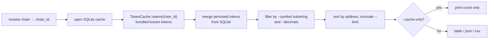

### 3.7 `scan` — raw on-chain event scans

Topic-level `eth_getLogs` scans; replaces the old Dune-query workflows. No cache writes.

```
mev-scout scan --kind trades|transfers|flashloans|liquidations|labels [--address 0x..] [--limit 500]
```

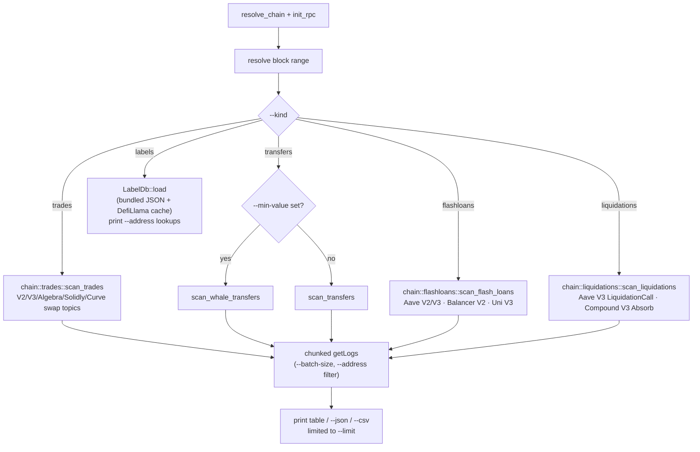

### 3.8 `replay` — single-block EVM debugger

Re-runs one cached block through revm and verifies results against cached receipts.

```
mev-scout replay --block 65000000 [--tx-index 42] [--analyze]
```

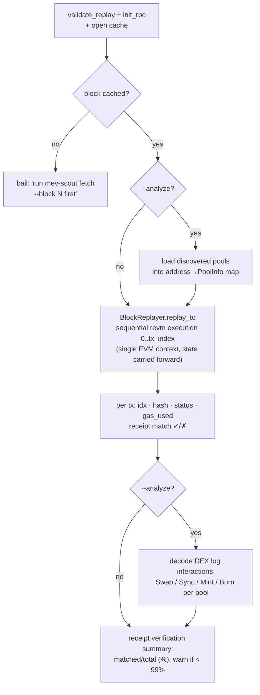

### 3.9 `report` — re-render saved results

Offline. Reads a `ResultsFile` JSON written by `run`/`live` and re-renders it — no chain access.

```
mev-scout report [--run-id run_1717...]
```

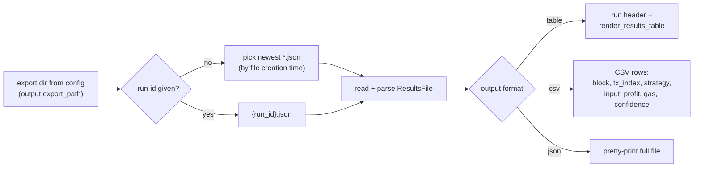

### 3.10 `config` — print resolved config

Offline, two lines of logic: merges TOML file (if any) with CLI overrides in `main.rs`, then serializes.

```
mev-scout config [-f custom.toml] [--verbose]
```

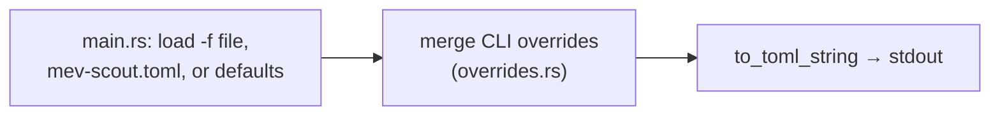

---

## 4. The engine core: how detection works

`BacktestRunner.run_block` (pipeline/runner.rs) is the heart of `run` and `live`:

1. **Load** block + txs from SQLite.
2. **Filter** — only txs whose `to` or log emitter matches a tracked pool/token are replayed through revm; all others are synthesized from cached receipts (the main performance optimization for large backtests).
3. **Apply** decoded Swap/Sync/Mint/Burn events to `PoolManager`, so all detectors see post-tx reserves.
4. **Detect** per tx, in order: two-hop arb → multi-hop arb (BFS ≤ depth 4) → JIT liquidity → sandwich → JIT+arb hybrid; liquidation and mempool strategies where context allows.
5. **Post-process** — dust filter (`min_profit_wei`), per-tx candidate cap, cross-block persistence scoring (decaying confidence, `PERSISTENCE_DECAY = 0.75`, grace 5 blocks), gas calibration from observed `gasUsed`.

The hybrid path (`run_range_hybrid`, used by `live`) picks `FullReplay` vs `LogOnly` per block based on `rpc.detect_state_horizon` — blocks deeper than available archive state skip EVM execution and lose only the EVM-context strategies.

## 5. Persistent artifacts

| Artifact | Produced by | Consumed by |
|---|---|---|
| SQLite `cache.db` (blocks, receipts, state, discovered pools, tokens, manifests) | `run`, `live`, `fetch`, `discover`, `validate-pools` | `run`, `live`, `replay`, `discover` (incremental), `tokens` |
| `results/*.json` (`run_{epoch}` / `live_{epoch}`) | `run`, `live` | `report` |
| Signature DB (4byte directory snapshot) | `fetch` (unless `--no-sig-resolve`) | tx decoding |
