# mev-scout — Architecture & CLI Command Guide

An MEV opportunity scanner & backtester for EVM chains (primary target: Polygon).
Two crates: one engine library and one CLI host:

- **`core/`** — `mev-scout-core`: engine + stores + shared job orchestration.
- **`cli/`** — `mev-scout-cli`: thin binary (`mev-scout`) with 11 subcommands. Parses args, loads config, presentation, dispatches to core.

---

## 1. Top-down module view

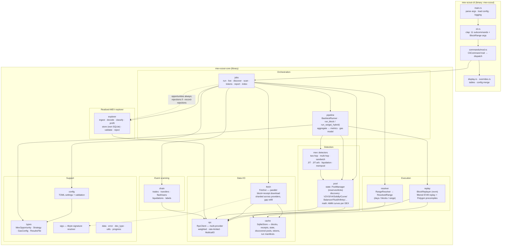

**Key relationships**

- The CLI is the only host: `CLI → core`. Shared long-running flows live in `core::jobs`.
- `pipeline` is the hub: `BacktestRunner` owns `BlockReplayer` + `PoolManager` and drives every detector per transaction.
- `cache` (SQLite) is the local-first backbone — fetch stores blocks there; replay and the runner read from it; pool discovery persists pools/tokens into it.
- `rpc` fronts the chain for everything: fetching, `eth_call` pool state, log scans, and replay's on-demand state misses (via `CachedRpcDb`).
- `explorer` answers "what was made" (realized MEV forensics) vs the detectors' "what could be made" — it ingests via RPC into its own SQLite store (`explorer_{chain}.sqlite`) so live index writes never contend with replay-path cache reads. Scanner `run`/`live` always persist detected opportunities there (via in-memory `ResultsFile` DTO); `--record-rejections` also stores rejected candidates for miss attribution.

---

## 2. CLI command map

| Command | Purpose | Chain access | Writes |
|---|---|---|---|
| `run` | Full backtest → opportunities | yes (fetch + eth_call) | SQLite cache, explorer SQLite |
| `live` | Stream new blocks, detect as they arrive | yes | SQLite cache, explorer SQLite |
| `fetch` | Pre-cache blocks only (no detection) | yes | SQLite cache |
| `discover` | Find pools (on-chain factories / aggregators) | yes (RPC and/or REST) | SQLite cache |
| `validate-pools` | Measure discovery accuracy vs GeckoTerminal | yes (RPC + REST) | SQLite cache |
| `tokens` | Populate / view token metadata cache | optional REST (`--enrich`) | SQLite `token_symbols` |
| `scan` | Raw event scans (trades/whales/flashloans/liqs) | yes (getLogs only) | — |
| `replay` | Debug a single block through revm | yes (fallback calls) | — |
| `report` | Re-render a recorded run from SQLite | no | — |
| `config` | Print fully-resolved TOML | no | — |
| `explorer` | Realized-MEV forensics (index/feed/stats/top/show) | yes (logs; optional traces) | Explorer SQLite store |

Invocation convention: the first example under each command uses
`cargo run -p mev-scout-cli -- --config mev-scout.toml …`. Later examples
shorten to `mev-scout` and assume the same config file and repo-root CWD.

---

## 3. Shared concepts

### Globals

Every subcommand accepts:

```powershell
cargo run -p mev-scout-cli -- --config mev-scout.toml --verbose config
mev-scout --quiet run --blocks 10
mev-scout -f custom.toml config
```

| Flag | Effect |
|---|---|
| `-f` / `--config FILE` | Load this TOML (else `mev-scout.toml` if present, else defaults) |
| `--verbose` | Debug-level tracing |
| `--quiet` | Suppress all output except the final summary |

### Config (TOML, not clap flags)

Chain, RPC endpoints, strategies, gas model, and listing format live in the
TOML file. Clap does **not** expose `--chain`, `--rpc-urls`, or `--output`.

```powershell
copy mev-scout.example.toml mev-scout.toml
# edit chain = "polygon", rpc_urls, output = "table"|"csv"|"json"
mev-scout config
```

Prefer `${ENV_VAR}` placeholders in RPC URLs; export keys in the same shell.
Unset placeholders stay literal and fail loudly at the provider. The listing
format for `tokens`, `scan`, and `report` is the TOML `output` key. Exceptions
that take their own JSON flag: `discover --json`, `validate-pools --json`.

### Block range (exactly one)

`run`, `fetch`, `discover` (on-chain / hybrid), and `scan` require exactly one
of:

```powershell
mev-scout run --days 7
mev-scout run --blocks 100
mev-scout run --block 65000000
mev-scout run --from-block 65000000 --to-block 65000100
```

`--days` is 1–365. `replay` takes `--block` only. `live` uses chain tip (no
range flags).

### Two SQLite stores

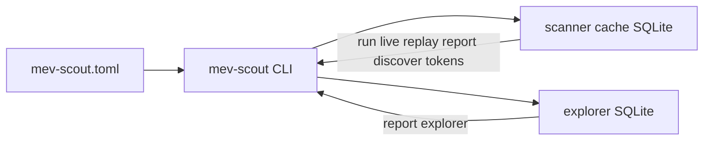

| Store | Typical path | Written by | Read by |
|---|---|---|---|
| Scanner cache | `cache/` per-chain DB | `run`, `live`, `fetch`, `discover`, `validate-pools`, `tokens` | `run`, `live`, `replay`, `discover --incremental`, `tokens`, `report` (manifests) |
| Explorer store | `explorer_{chain}.sqlite` | `run`/`live` (opportunities; rejections with `--record-rejections`), `explorer index` | `report`, `explorer *` |

---

## 4. Command reference (per command)

### 4.1 `config` — print resolved TOML

Prints the fully merged config (file + defaults) as TOML. Offline; no chain
access.

```powershell
cargo run -p mev-scout-cli -- --config mev-scout.toml config
mev-scout -f custom.toml config
mev-scout --verbose config
```

`--verbose` only raises log level; the TOML dump itself is unchanged.

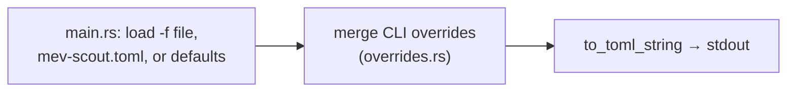

### 4.2 `discover` — build the pool universe

Finds pools from factory events and/or free aggregators; result feeds all other
commands (they read the discovery cache). Default `--source` is `onchain`.
DefiLlama yields is **not** a pool source (UUID ids, no AMM pool addresses).

```powershell
cargo run -p mev-scout-cli -- --config mev-scout.toml discover --days 30
mev-scout discover --source onchain --days 30
mev-scout discover --source remote --max-pools 500 --min-tvl 10000
mev-scout discover --source hybrid --days 14 --enrich
mev-scout discover --incremental
mev-scout discover --source remote --resolve-remote-metadata
mev-scout discover --health-check false
mev-scout discover --json
mev-scout discover --days 7 --batch-size 2000 --rpc-concurrency 4
mev-scout discover --solidly-fee-bps 30
```

| Flag | Concept |
|---|---|
| `--source onchain\|remote\|hybrid` | Factory logs only, GeckoTerminal+DexScreener only, or union deduped by address |
| `--days` / `--blocks` / … | On-chain / hybrid lookback (remote skips the range) |
| `--incremental` | Resume from max cached `creation_block` |
| `--enrich` | Attach TVL / volume from GeckoTerminal |
| `--min-tvl` / `--max-pools` | Remote dust filter and pagination cap |
| `--resolve-remote-metadata` | Multicall3 fill of fee/tickSpacing/tokens for remote CL pools |
| `--health-check` | Drop drained/paused pools (default on) |
| `--json` | Machine-readable pool list |
| `--batch-size` / `--rpc-concurrency` | getLogs chunk size and metadata concurrency |
| `--solidly-fee-bps` | Fee override for Solidly-style pools |

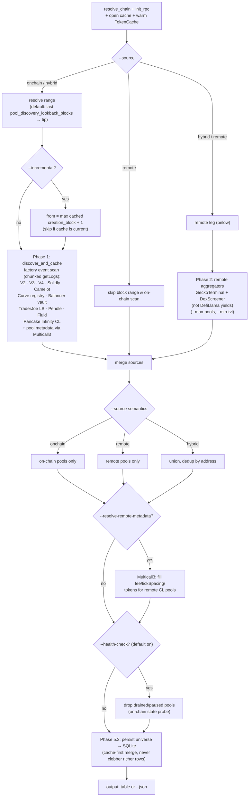

### 4.3 `validate-pools` — discovery accuracy audit

Compares on-chain discovery (set A) against GeckoTerminal references (set B).
Reports recall per DEX, extras, field mismatches, and TVL deltas.

```powershell
cargo run -p mev-scout-cli -- --config mev-scout.toml validate-pools --days 7
mev-scout validate-pools --days 7 --source gecko
mev-scout validate-pools --json
mev-scout validate-pools --markdown-out report.md
```

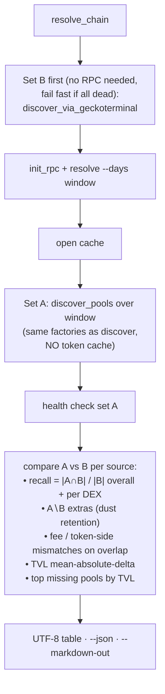

### 4.4 `tokens` — token metadata cache

Offline by default (bundled known-token list + SQLite). Optional `--enrich`
pulls missing **symbol/decimals** from DefiLlama coins and **name/icon URL**
from CoinGecko's contract endpoint. Listing format follows TOML `output`.

```powershell
cargo run -p mev-scout-cli -- --config mev-scout.toml tokens
mev-scout tokens --symbol USDC
mev-scout tokens --decimals 6 --limit 50
mev-scout tokens --cache-only
mev-scout tokens --enrich
# set output = "json" or "csv" in mev-scout.toml for machine-readable listing
```

```mermaid
flowchart LR
    A["resolve chain → chain_id"] --> B["open SQLite cache"]
    B --> C["TokenCache::warm(chain_id)<br/>bundled known tokens"]
    C --> D["merge persisted tokens<br/>from SQLite"]
    D --> E{"--enrich?"}
    E -- yes --> F["seed addresses from pool_info"]
    F --> G["DefiLlama coins<br/>symbol / decimals"]
    G --> H["CoinGecko contract<br/>name / icon_url (capped)"]
    H --> I["persist_all → SQLite"]
    I --> J
    E -- no --> J["filter by --symbol / --decimals"]
    J --> K["sort by address, truncate --limit"]
    K --> L{"--cache-only?"}
    L -- yes --> M["print count only"]
    L -- no --> N["table / json / csv"]
```

### 4.5 `fetch` — pre-cache blocks only

Warms the SQLite cache so later `run`/`replay` are fast / offline-friendly. No
detection.

```powershell
cargo run -p mev-scout-cli -- --config mev-scout.toml fetch --blocks 1000
mev-scout fetch --days 3
mev-scout fetch --block 65000000
mev-scout fetch --from-block 65000000 --to-block 65001000
mev-scout fetch --blocks 500 --batch-rpc
mev-scout fetch --blocks 500 --no-sig-resolve
```

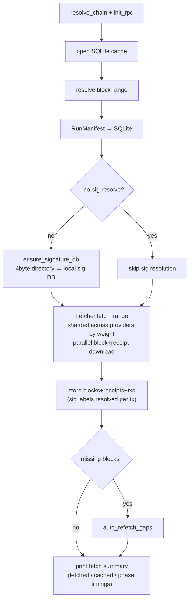

### 4.6 `run` — the full backtest

The main pipeline. Everything is cached first, then replayed and detected.
Opportunities always land in the explorer store; `--record-rejections` also
stores rejected candidates for offline analysis.

```powershell
cargo run -p mev-scout-cli -- --config mev-scout.toml run --blocks 100
mev-scout run --days 7
mev-scout run --block 65000000
mev-scout run --from-block 65000000 --to-block 65000100
mev-scout run --blocks 100 --batch-rpc
mev-scout run --days 1 --record-rejections
mev-scout run --blocks 50 --progress json
```

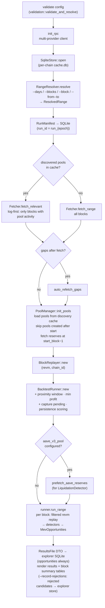

Inside `run_range` — per block:

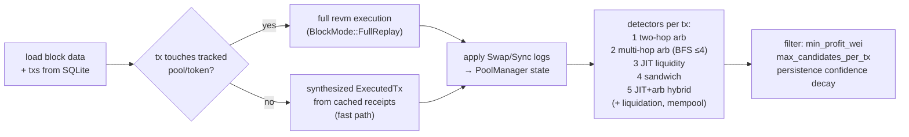

### 4.7 `live` — real-time streaming detection

Same engine as `run`, against chain tip. One-shot (default) or continuous
polling with `--loop`.

```powershell
cargo run -p mev-scout-cli -- --config mev-scout.toml live
mev-scout live --loop
mev-scout live --loop --duration 1h
mev-scout live --loop --poll-interval 2000
mev-scout live --loop --max-blocks 50
mev-scout live --loop --record-rejections
mev-scout live --loop --progress json
```

`--duration` and `--max-blocks` require `--loop`. Poll interval is
`--poll-interval` (milliseconds; default 2000).

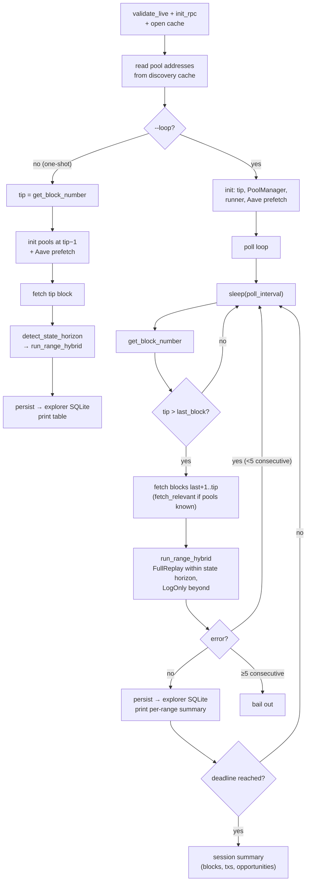

### 4.8 `replay` — single-block EVM debugger

Re-runs one **already cached** block through revm and verifies results against
cached receipts. Fetch the block first if needed.

```powershell
cargo run -p mev-scout-cli -- --config mev-scout.toml fetch --block 65000000
mev-scout replay --block 65000000
mev-scout replay --block 65000000 --tx-index 42
mev-scout replay --block 65000000 --analyze
```

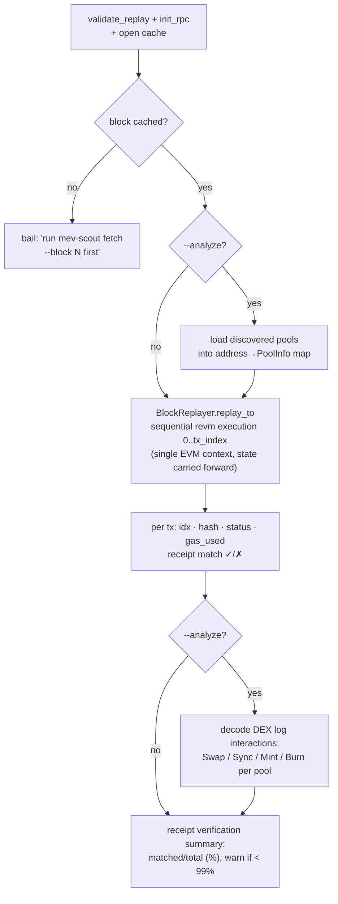

### 4.9 `scan` — raw on-chain event scans

Topic-level `eth_getLogs` scans; replaces the old Dune-query workflows. No
cache writes. Listing format follows TOML `output`.

```powershell
cargo run -p mev-scout-cli -- --config mev-scout.toml scan --blocks 100 --kind trades
mev-scout scan --days 1 --kind transfers
mev-scout scan --days 1 --kind transfers --min-value 1000000000000000000
mev-scout scan --blocks 500 --kind flashloans
mev-scout scan --blocks 500 --kind liquidations
mev-scout scan --kind labels --address 0x…
mev-scout scan --blocks 200 --kind trades --address 0x… --limit 100 --batch-size 500
```

| `--kind` | What it scans |
|---|---|
| `trades` | DEX swap topics (V2/V3/Algebra/Solidly/Curve) |
| `transfers` | ERC-20 Transfer; with `--min-value`, whale path |
| `flashloans` | Aave V2/V3 · Balancer V2 · Uni V3 |
| `liquidations` | Aave V3 LiquidationCall · Compound V3 Absorb |
| `labels` | Address label lookup (bundled JSON + DefiLlama cache) |

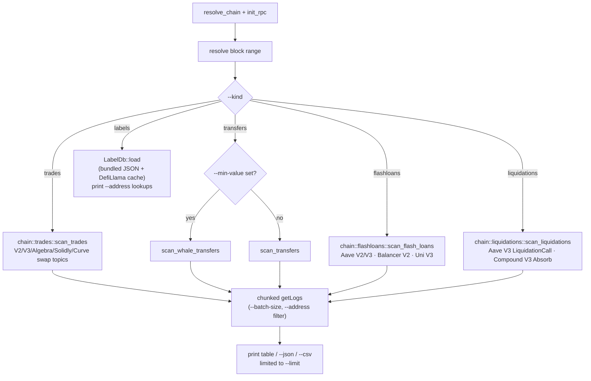

### 4.10 `report` — re-render saved results

Offline. Reads run metadata from the cache DB (`run_manifests`) and
opportunities from the explorer DB. No chain access; no on-disk JSON result
files. Format follows TOML `output`.

```powershell
cargo run -p mev-scout-cli -- --config mev-scout.toml report
mev-scout report --run-id run_1717…
# set output = "csv" or "json" in mev-scout.toml for machine-readable forms
```

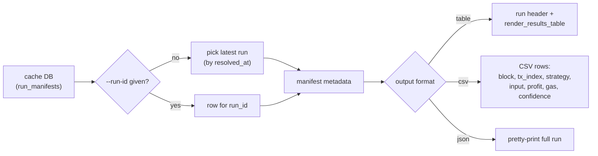

### 4.11 `explorer` — realized-MEV forensics

Forensic reconstruction of MEV that was actually extracted on-chain — the
counterpart to the scanner's simulated opportunities. Pipeline: ingest → decode
→ classify → profit → store (`explorer_{chain}.sqlite`) → query surface below.
Scanner `run`/`live` persist opportunities into the same store; `--record-rejections`
adds rejected candidates for offline analysis.

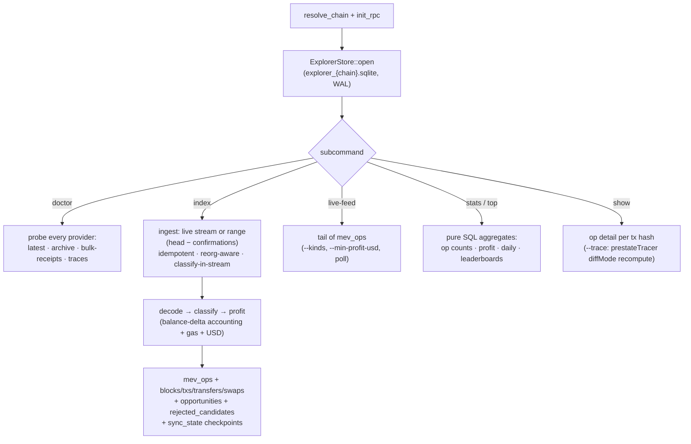

#### 4.11.1 `explorer doctor`

Probes every configured provider (latest block, archive, bulk receipts, traces)
and prints the capability matrix.

```powershell
cargo run -p mev-scout-cli -- --config mev-scout.toml explorer doctor
```

#### 4.11.2 `explorer index`

Stream-index tip blocks into the explorer store (live), **or** backfill a
historical range. Live mode is idempotent, resumable, reorg-aware; classifies
in-stream. Follows `head − confirmations` until cancelled (Ctrl+C) or
`--duration` elapses. Range mode indexes every confirmed block in
`[--from-block, --to-block]` without `LIVE_MAX_LAG_BLOCKS` skipping.

```powershell
mev-scout explorer index
mev-scout explorer index --duration 15m
mev-scout explorer index --duration 1h
mev-scout explorer index --from-block 50000000 --to-block 50001000
```

`LIVE_MAX_LAG_BLOCKS` (256) applies to **live** only: if the indexer falls more
than ~256 blocks behind tip it skips backlog to stay near tip. Use range mode
for historical windows — live lag-skip is not a backfill substitute.
#### 4.11.3 `explorer live-feed`

mev.zone-style live feed of realized ops (tail of the indexed store). Run
`explorer index` alongside (or ensure the store already has a tail).
Default kinds **exclude** `frontrun` / `backrun` (Phase 3 ship gate).

```powershell
mev-scout explorer live-feed
mev-scout explorer live-feed --kinds all
mev-scout explorer live-feed --kinds arb_atomic,sandwich,liquidation
mev-scout explorer live-feed --min-profit-usd 10
mev-scout explorer live-feed --poll-interval-ms 2000 --duration 90s
mev-scout explorer live-feed --arb-shape triangular
```

Default kinds **exclude** `frontrun` / `backrun` (Phase 3 ship gate) unless
`[explorer].live_feed_kinds` is set in TOML. Logs-only causal kinds are
`tier=inferred` until REVM counterfactuals land.

Kinds: `arb_atomic`, `sandwich`, `frontrun`, `backrun`, `liquidation`, `jit`,
`jit_arb`, `unknown`. Atomic arbs carry `details.arb_meta` (`arb_shape`,
`hop_count`, `dex_count`, `is_cross_dex`, `flashloan_funded`).

#### 4.11.4 `explorer stats`

Pure SQL aggregates: op counts, profit totals, daily breakdown, top
searchers/pools.

```powershell
mev-scout explorer stats
mev-scout explorer stats --since 7d
mev-scout explorer stats --since 1d --kind sandwich
mev-scout explorer stats --since 30d --window week
mev-scout explorer stats --since 7d --arb-shape triangular
```

`--since` accepts `1d` | `7d` | `30d` | `all` (default all). `--kind` filters
to one pattern. `--arb-shape` samples matching `arb_atomic` ops.

#### 4.11.5 `explorer top`

Leaderboards by sender, token, or pool.

```powershell
mev-scout explorer top --by sender --metric profit
mev-scout explorer top --by pool --metric ops --since 7d --limit 20
mev-scout explorer top --by token --metric profit --since 30d
```

#### 4.11.6 `explorer show`

Operation detail for a transaction hash. `--trace` recomputes exact profit via
`debug_traceTransaction` (prestateTracer diffMode).

```powershell
mev-scout explorer show 0xabc…
mev-scout explorer show 0xabc… --trace
```

#### Classifier-change replay recipe (wipe + reindex)

Any change to `decode` / `classify` / P&L invalidates existing `mev_ops` rows for
the affected window, so before/after Phase numbers are only comparable after a
replay. `index` is replay-safe (INSERT OR REPLACE, reorg-aware, idempotent), so
the wipe is required only for classifier *semantics* changes, not plain re-indexes.
Because `explorer index` is live-only by default, rewind the checkpoint and let live
re-index from tip (or from a lowered `indexed_to`), or use `--from-block`/`--to-block`:

```bash
# 1) Wipe the affected window on the forensic DB (example: Polygon, from N).
#    Remove classified ops + classified-block markers and rewind the checkpoint.
sqlite3 explorer_polygon.sqlite \
  "DELETE FROM mev_ops       WHERE block_number >= N;
   DELETE FROM blocks_classified WHERE block >= N;
   UPDATE sync_state SET indexed_to = N-1 WHERE chain_id = 137;"

# 2) Resume live indexing (skips backlog beyond LIVE_MAX_LAG_BLOCKS of tip).
mev-scout explorer index --duration 1h
```

#### Phase-0 baseline recipe and ship gates

Live-window recipe (e.g. Avalanche / Polygon): run the indexer for a measurement
window, then inspect with `stats` / `show`:

```bash
mev-scout explorer index --duration 1h
mev-scout explorer stats --since 1d
```

Record coverage notes on every phase merge (`cargo test` + clippy alone are not the
gate). Numbers are data-dependent — tests assert report *shape* only:

| Window | ops indexed | notes | `arb_likely` parity |
|---|---|---|---|
| *(pending — run recipe above with RPC)* | — | — | `false` (default) |

Avalanche C-Chain factories in [`core/data/chains.toml`](../core/data/chains.toml)
now include LFJ V1 + Sushi + Pangolin V2, Curve Stableswap NG, Uni/Pharaoh/
Pangolin V3, LFJ LB + Pharaoh DLMM. Use public endpoints from
`mev-scout.example.toml` `[chains.avalanche]` (or a paid archive URL) and:

```bash
# config: chain = "avalanche"
mev-scout explorer doctor
mev-scout discover --source hybrid --days 7
mev-scout explorer index --duration 1h
# or historical:
mev-scout explorer index --from-block N --to-block M
mev-scout explorer stats --since 1d
```

Paste stats / sample `show` output into notes above. `arb_likely_parity` defaults to
`false` (closed-cycle-only arb) to match the opportunity detection spec.

Gates that depend on this table:
- **Phase 1.2**: `explorer.arb_likely_parity=false` is the default (precision over
  mevlive catch-all recall). Set `true` only for explicit mevlive-parity experiments.
- **Phase 3 ship gate**: labeled golden set (Phase 0.5) must show acceptable
  backrun/frontrun precision before those kinds are enabled in live-feed defaults.
  Synthetic CI set: `cargo test -p mev-scout-core golden`. Live-feed default
  **excludes** `frontrun`/`backrun`; pass `--kinds all`, an explicit list, or set
  `[explorer].live_feed_kinds` in TOML to opt in. Causal ops are tagged
  `tier=inferred` (logs-only) until REVM counterfactuals land.
  Chain-curated AVAX labels remain a follow-up once an RPC baseline window is available.

#### Known biases / methodology notes

- Logs-only backrun/frontrun are **not** REVM `profit(B|before)` vs `profit(B|after)` —
  they are inferred causal proxies with §23 evidence codes in `details`.
- JIT covers Uni V3 Mint/Burn **and** LFJ/Pharaoh LB DepositedToBins/WithdrawnFromBins
  (bin range mapped into tick_lower/tick_upper; overlap = any same-pool swap).
- Avalanche liquidations: Aave V3 topic decode (pool in chains.toml). Benqi/GMX
  not in the explorer liquidation registry yet.

| Bias | Status | Notes |
|---|---|---|
| Historical `arb_likely` catch-all | Off by default (`arb_likely_parity=false`) | Opt-in only; when true, single-hop profitable residuals label `arb_atomic` (mevlive Type=Arbitrage parity). |
| Logs-only Backrun / Frontrun | By design | Execution-price proxies ≠ REVM `profit(B\|before_A)` vs `profit(B\|after_A)`. `STATE_DELTA_MATCH` / `PROFIT_VERIFIED` are **not** REVM-verified. |
| Gas | Mitigated (Phase 2.1) | Prefer receipt `effectiveGasPrice`, then legacy `gasPrice`; only fall back to `base_fee + priority`. |
| Multi-token profit | Mitigated (Phase 2.3) | Persist sums USD across all positive residuals; `profit_token` remains display-primary. JIT fee-capture stays unit-reported (`profit_token=None`). |
| Hourly pricing / FOT | Partial | Hourly token prices at persist; FOT/rebase tokens flagged `usd_approximate` in details. Long-tail decimals via Multicall3; realized-rate fallback for unpriced residuals. |
| Uni V3 `Flash` | Deferred | Not netted as Aave-style flash loan (different callback repay semantics). |
| Sandwich contract mediation | Logs-only | `tx.to` on front/back tags `contract_mediated`; store-backed labeled-searcher registry not required. |
| JIT cross-block reorg | Known limitation | Exact-key + `>=` liquidity close; cannot restore a position whose Burn is unwound by a reorg. |

---

## 5. The engine core: how detection works

`BacktestRunner.run_block` (pipeline/runner.rs) is the heart of `run` and `live`:

1. **Load** block + txs from SQLite.
2. **Filter** — only txs whose `to` or log emitter matches a tracked pool/token are replayed through revm; all others are synthesized from cached receipts (the main performance optimization for large backtests).
3. **Apply** decoded Swap/Sync/Mint/Burn events to `PoolManager`, so all detectors see post-tx reserves.
4. **Detect** per tx, in order: two-hop arb → multi-hop arb (BFS ≤ depth 4) → JIT liquidity → sandwich → JIT+arb hybrid; liquidation and mempool strategies where context allows.
5. **Post-process** — dust filter (`min_profit_wei`), per-tx candidate cap, cross-block persistence scoring (decaying confidence, `PERSISTENCE_DECAY = 0.75`, grace 5 blocks), gas calibration from observed `gasUsed`.

The hybrid path (`run_range_hybrid`, used by `live`) picks `FullReplay` vs `LogOnly` per block based on `rpc.detect_state_horizon` — blocks deeper than available archive state skip EVM execution and lose only the EVM-context strategies.

## 6. Persistent artifacts

| Artifact | Produced by | Consumed by |
|---|---|---|
| SQLite `cache.db` (blocks, receipts, state, discovered pools, tokens, run manifests) | `run`, `live`, `fetch`, `discover`, `validate-pools` | `run`, `live`, `replay`, `discover` (incremental), `tokens`, `report` (manifests) |
| Explorer store `explorer_{chain}.sqlite` — `opportunities` (+ optional `rejected_candidates`) | `run`, `live` (always opportunities; rejections with `--record-rejections`) | `report` |
| Explorer store `explorer_{chain}.sqlite` — forensic layer (blocks, txs, transfers, swaps, `mev_ops`, sync_state, …) | `explorer index` | `explorer` CLI |
| Signature DB (4byte directory snapshot) | `fetch` (unless `--no-sig-resolve`) | tx decoding |

`ResultsFile` is an in-memory / presentation DTO (CLI tables) — not a durable on-disk JSON artifact.
