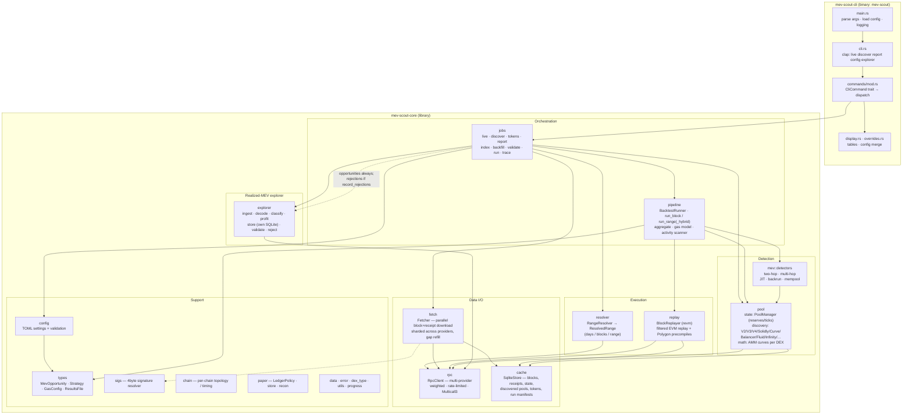
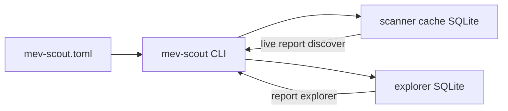

# mev-scout — Architecture

An MEV opportunity scanner & backtester for EVM chains (primary target: Polygon).
Two crates: one engine library and one CLI host:

- **`core/`** — `mev-scout-core`: engine + stores + shared job orchestration.
- **`cli/`** — `mev-scout-cli`: thin binary (`mev-scout`) with 5 top-level
  subcommands (`live discover report config explorer`) plus the `explorer`
  nest. Parses args, loads config, presentation, dispatches to core.

Command reference, flags, and per-command flows: see [CLI.md](CLI.md).

---

## 1. Top-down module view

```mermaid
flowchart TB
    subgraph CLI["mev-scout-cli (binary: mev-scout)"]
        MAIN["main.rs<br/>parse args · load config · logging"]
        CLIDEF["cli.rs<br/>clap: live discover report config explorer"]
        DISPATCH["commands/mod.rs<br/>CliCommand trait → dispatch"]
        UI["display.rs · overrides.rs<br/>tables · config merge"]
    end

    subgraph CORE["mev-scout-core (library)"]
        direction TB

        subgraph ORCH["Orchestration"]
            COREJOBS["jobs<br/>live · discover · tokens · report<br/>index · backfill · validate · run · trace"]
            PIPE["pipeline<br/>BacktestRunner · run_block / run_range(_hybrid)<br/>aggregate · gas model · activity scanner"]
        end

        subgraph DETECT["Detection"]
            MEV["mev::detectors<br/>two-hop · multi-hop<br/>JIT · backrun · mempool"]
            POOL["pool<br/>state: PoolManager (reserves/ticks)<br/>discovery: V2/V3/V4/Solidly/Curve/<br/>Balancer/Fluid/Infinity/…<br/>math: AMM curves per DEX"]
        end

        subgraph EXEC["Execution"]
            REPLAY["replay<br/>BlockReplayer (revm)<br/>filtered EVM replay + Polygon precompiles"]
            RESOLVER["resolver<br/>RangeResolver → ResolvedRange<br/>(days / blocks / range)"]
        end

        subgraph IO["Data I/O"]
            FETCH["fetch<br/>Fetcher — parallel block+receipt download<br/>sharded across providers, gap refill"]
            RPC["rpc<br/>RpcClient — multi-provider<br/>weighted · rate-limited · Multicall3"]
            CACHE["cache<br/>SqliteStore — blocks, receipts, state,<br/>discovered pools, tokens, run manifests"]
        end

        subgraph EXPLORE["Realized-MEV explorer"]
            EXPL["explorer<br/>ingest · decode · classify · profit<br/>store (own SQLite) · validate · reject"]
        end

        subgraph SUPPORT["Support"]
            CFG["config<br/>TOML settings + validation"]
            TYPES["types<br/>MevOpportunity · Strategy · GasConfig · ResultsFile"]
            SIGS["sigs — 4byte signature resolver"]
            CHAIN["chain — per-chain topology / timing"]
            PAPER2["paper — LedgerPolicy · store · recon"]
            MISC["data · error · dex_type · utils · progress"]
        end
    end

    MAIN --> CLIDEF --> DISPATCH
    DISPATCH --> UI
    DISPATCH --> COREJOBS

    COREJOBS --> RESOLVER
    COREJOBS --> FETCH
    COREJOBS --> POOL
    COREJOBS --> PIPE
    COREJOBS --> EXPL
    COREJOBS --> CFG

    RESOLVER --> RPC
    FETCH --> RPC
    FETCH --> CACHE
    PIPE --> REPLAY
    REPLAY --> CACHE
    REPLAY --> RPC
    PIPE --> POOL
    PIPE --> MEV
    MEV --> POOL
    POOL --> RPC
    POOL --> CACHE
    EXPL --> RPC
    COREJOBS -. "opportunities always;<br/>rejections if record_rejections" .-> EXPL
    CFG --> TYPES
    PIPE --> TYPES
    FETCH -.-> SIGS
```

**Key relationships**

- The CLI is the only host: `CLI → core`. Shared long-running flows live in `core::jobs`.
- `pipeline` is the hub: `BacktestRunner` owns `BlockReplayer` + `PoolManager` and drives every detector per transaction.
- `cache` (SQLite) is the local-first backbone — `live` fetches blocks into it; the runner reads from it; pool discovery persists pools/tokens into it.
- `rpc` fronts the chain for everything: fetching, `eth_call` pool state, and replay's on-demand state misses (via `CachedRpcDb`).
- `explorer` answers "what was made" (realized MEV forensics) vs the detectors' "what could be made" — it ingests via RPC into its own SQLite store (`explorer-{chain}.sqlite`) so live index writes never contend with replay-path cache reads. Scanner `live` always persists detected opportunities there (via in-memory `ResultsFile` DTO); `record_rejections = true` also stores rejected candidates for miss attribution.

---

## 2. Two SQLite stores

```mermaid
flowchart LR
    toml[mev-scout.toml]
    cli[mev-scout CLI]
    cache[scanner cache SQLite]
    explorer[explorer SQLite]
    toml --> cli
    cli --> cache
    cli --> explorer
    cache -->|"live report discover"| cli
    explorer -->|"report explorer"| cli
```

| Store | Typical path | Written by | Read by |
|---|---|---|---|
| Scanner cache | `cache/` per-chain DB | `live` (incl. bootstrap token + pool seeding), `discover` | `live`, `discover`, `report` (manifests) |
| Explorer store | `explorer-{chain}.sqlite` (`./cache/`) | `live` (opportunities; rejections when `record_rejections = true`; one `paper_sessions` ledger row per session), `explorer index` | `report`, `explorer *` |

---

## 3. The engine core: how detection works

`BacktestRunner.run_block` (pipeline/runner.rs) is the heart of `run` and `live`:

1. **Load** block + txs from SQLite.
2. **Filter** — only txs whose `to` or log emitter matches a tracked pool/token are replayed through revm; all others are synthesized from cached receipts (the main performance optimization for large backtests).
3. **Apply** decoded Swap/Sync/Mint/Burn events to `PoolManager`, so all detectors see post-tx reserves.
4. **Detect** per tx, in order: two-hop arb → multi-hop arb (BFS ≤ depth 4) → JIT liquidity → backrun (pre-image captured on `S_{i-1}` before the state update, `post_detect` after); mempool strategies at range level where context allows.
5. **Post-process** — backrun claims supersede the plain arb claim for the same key (`suppress_superseded_arbs`, so P&L is never double-counted), then dust filter (`min_profit_wei`), per-tx candidate cap, cross-block persistence scoring (decaying confidence, `PERSISTENCE_DECAY = 0.75`, grace 5 blocks), gas calibration from observed `gasUsed`.

The hybrid path (`run_range_hybrid`, used by `live`) picks `FullReplay` vs `LogOnly` per block based on `RpcClient::detect_state_horizon` (an on-chain archive-state probe, not a TOML key) — blocks deeper than available archive state skip EVM execution and lose only the EVM-context strategies.

## 4. Persistent artifacts

| Artifact | Produced by | Consumed by |
|---|---|---|
| SQLite `cache.db` (blocks, receipts, state, discovered pools, tokens, run manifests) | `live` (incl. bootstrap), `discover` | `live`, `discover`, `report` (manifests) |
| Explorer store `explorer-{chain}.sqlite` — `opportunities` (+ optional `rejected_candidates`) | `live` (always opportunities; rejections when `record_rejections = true`) | `report` |
| Explorer store — `paper_sessions` / `paper_fills` | `live` (one session row written at session end) | `report` (session P&L) |
| Explorer store `explorer-{chain}.sqlite` — forensic layer (blocks, txs, transfers, swaps, `mev_ops`, sync_state, …) | `explorer index` | `explorer` CLI |
| Signature DB (4byte directory snapshot) | resolver only (`core::sigs::SignatureResolver`); the downloader and bundled fallback tables were removed as unreachable. Still **not wired** into `run`/`live` ingest | tx decoding (future) |

`ResultsFile` is an in-memory / presentation DTO (CLI tables) — not a durable on-disk JSON artifact.
