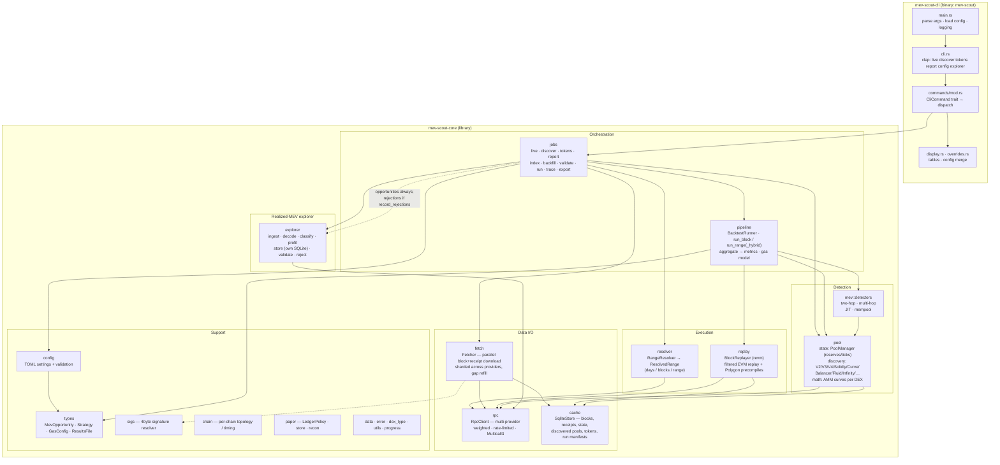
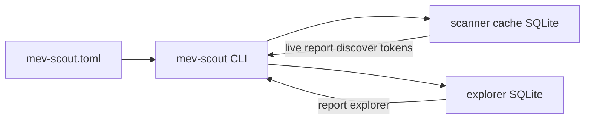
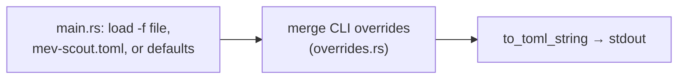
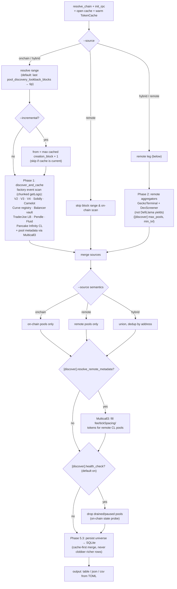
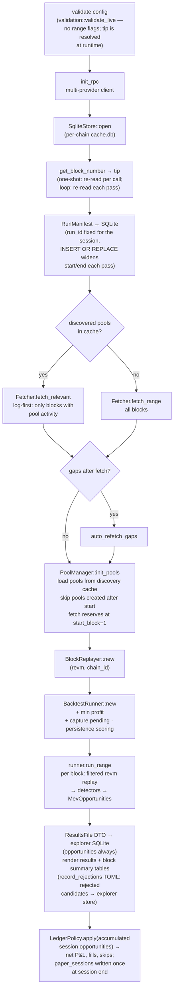
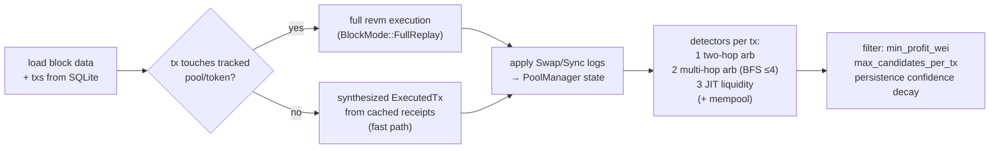
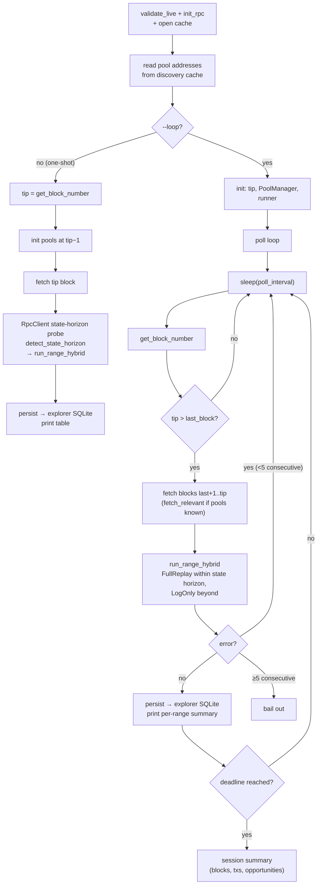
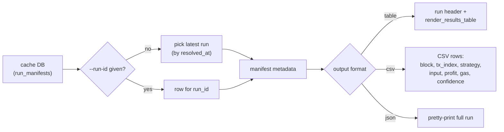
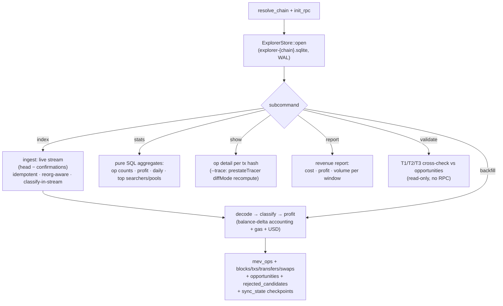
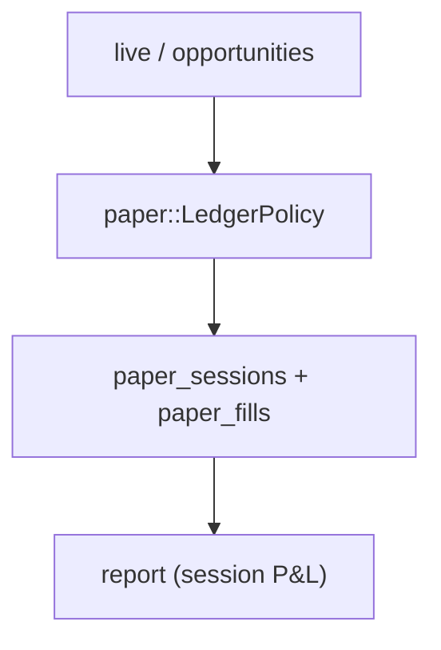

# mev-scout — Architecture & CLI Command Guide

An MEV opportunity scanner & backtester for EVM chains (primary target: Polygon).
Two crates: one engine library and one CLI host:

- **`core/`** — `mev-scout-core`: engine + stores + shared job orchestration.
- **`cli/`** — `mev-scout-cli`: thin binary (`mev-scout`) with 6 top-level
  subcommands (`live discover tokens report config explorer`, plus the
  `explorer` nest). Parses args, loads config, presentation, dispatches to core.

---

## 1. Top-down module view


```mermaid
flowchart TB
    subgraph CLI["mev-scout-cli (binary: mev-scout)"]
        MAIN["main.rs<br/>parse args · load config · logging"]
        CLIDEF["cli.rs<br/>clap: live discover tokens report config explorer"]
        DISPATCH["commands/mod.rs<br/>CliCommand trait → dispatch"]
        UI["display.rs · overrides.rs<br/>tables · config merge"]
    end

    subgraph CORE["mev-scout-core (library)"]
        direction TB

        subgraph ORCH["Orchestration"]
            COREJOBS["jobs<br/>live · discover · tokens · report<br/>index · backfill · validate · run · trace · export"]
            PIPE["pipeline<br/>BacktestRunner · run_block / run_range(_hybrid)<br/>aggregate → metrics · gas model"]
        end

        subgraph DETECT["Detection"]
            MEV["mev::detectors<br/>two-hop · multi-hop<br/>JIT · mempool"]
            POOL["pool<br/>state: PoolManager (reserves/ticks)<br/>discovery: V2/V3/V4/Solidly/Curve/<br/>Balancer/Fluid/Infinity/…<br/>math: AMM curves per DEX"]
        end

        subgraph EXEC["Execution"]
            REPLAY["replay<br/>BlockReplayer (revm)<br/>filtered EVM replay + Polygon precompiles"]
            RESOLVER["resolver<br/>RangeResolver → ResolvedRange<br/>(days / blocks / range)"]
        end

        subgraph IO["Data I/O"]
            FETCH["fetch<br/>Fetcher — parallel block+receipt download<br/>sharded across providers, gap refill"]
            RPC["rpc<br/>RpcClient — multi-provider<br/>weighted · rate-limited · Multicall3"]
            CACHE["cache<br/>SqliteStore — blocks, receipts, state,<br/>discovered pools, tokens, run manifests"]
        end

        subgraph EXPLORE["Realized-MEV explorer"]
            EXPL["explorer<br/>ingest · decode · classify · profit<br/>store (own SQLite) · validate · reject"]
        end

        subgraph SUPPORT["Support"]
            CFG["config<br/>TOML settings + validation"]
            TYPES["types<br/>MevOpportunity · Strategy · GasConfig · ResultsFile"]
            SIGS["sigs — 4byte signature resolver"]
            CHAIN["chain — per-chain topology / timing"]
            PAPER2["paper — LedgerPolicy · store · recon"]
            MISC["data · error · dex_type · utils · progress"]
        end
    end

    MAIN --> CLIDEF --> DISPATCH
    DISPATCH --> UI
    DISPATCH --> COREJOBS

    COREJOBS --> RESOLVER
    COREJOBS --> FETCH
    COREJOBS --> POOL
    COREJOBS --> PIPE
    COREJOBS --> EXPL
    COREJOBS --> CFG

    RESOLVER --> RPC
    FETCH --> RPC
    FETCH --> CACHE
    PIPE --> REPLAY
    REPLAY --> CACHE
    REPLAY --> RPC
    PIPE --> POOL
    PIPE --> MEV
    MEV --> POOL
    POOL --> RPC
    POOL --> CACHE
    EXPL --> RPC
    COREJOBS -. "opportunities always;<br/>rejections if record_rejections" .-> EXPL
    CFG --> TYPES
    PIPE --> TYPES
    FETCH -.-> SIGS
```

**Key relationships**

- The CLI is the only host: `CLI → core`. Shared long-running flows live in `core::jobs`.
- `pipeline` is the hub: `BacktestRunner` owns `BlockReplayer` + `PoolManager` and drives every detector per transaction.
- `cache` (SQLite) is the local-first backbone — `live` fetches blocks into it; the runner reads from it; pool discovery persists pools/tokens into it.
- `rpc` fronts the chain for everything: fetching, `eth_call` pool state, and replay's on-demand state misses (via `CachedRpcDb`).
- `explorer` answers "what was made" (realized MEV forensics) vs the detectors' "what could be made" — it ingests via RPC into its own SQLite store (`explorer-{chain}.sqlite`) so live index writes never contend with replay-path cache reads. Scanner `live` always persists detected opportunities there (via in-memory `ResultsFile` DTO); `record_rejections = true` also stores rejected candidates for miss attribution.

---

## 2. CLI command map

| Command | Purpose | Chain access | Writes |
|---|---|---|---|
| `live` | Detect at tip → opportunities + virtual P&L ledger | yes | SQLite cache, explorer SQLite |
| `discover` | Find pools (on-chain factories / aggregators) | yes (RPC and/or REST) | SQLite cache |
| `tokens` | Populate / view token metadata cache | optional REST (`--enrich`) | SQLite `token_symbols` |
| `report` | Re-render a recorded run from SQLite | no | — |
| `config` | Print fully-resolved TOML | no | — |
| `explorer` | Realized-MEV forensics (`index` / `stats` / `show` / `report` / `backfill` / `validate`) | yes (logs; optional traces); backfill/index yes | Explorer SQLite store |

Product split: **`live`** = what *could* be made, plus the theoretical session
P&L of taking those detections with a virtual gas wallet (no competition);
**`explorer`** = what *was* made.

The `run` and `paper` commands were removed. `live` absorbed both: it detects at
chain tip (replacing `run`'s one-shot range scan) and its paper ledger is always
on (replacing `paper run` / `paper live`). `report` prints a run's ledger session
alongside its results.

Invocation convention: the first example under each command uses
`cargo run -p mev-scout-cli -- --config mev-scout.toml …`. Later examples
shorten to `mev-scout` and assume the same config file and repo-root CWD.

---

## 3. Shared concepts

### Globals

Every subcommand accepts:

```powershell
cargo run -p mev-scout-cli -- --config mev-scout.toml --verbose config
mev-scout --quiet live
mev-scout -f custom.toml config
```

| Flag | Effect |
|---|---|
| `-f` / `--config FILE` | Load this TOML (else `mev-scout.toml` if present, else defaults) |
| `--verbose` | Debug-level tracing |
| `--quiet` | Set the log/tracing filter to `error` (suppresses log lines; program tables/summaries on stdout are unaffected) |

### Config (TOML, not clap flags)

Chain, RPC endpoints, strategies, gas model, and listing format live in the
TOML file. Clap does **not** expose `--chain`, `--rpc-urls`, or `--output`.

```powershell
copy mev-scout.example.toml mev-scout.toml
# edit chain = "polygon", rpc_urls, output = "table"|"csv"|"json"
mev-scout config
```

Prefer `${ENV_VAR}` placeholders in RPC URLs; export keys in the same shell.
Unset placeholders stay literal and fail loudly at the provider. The listing
format for `tokens`, `report`, and `discover` is the TOML `output` key
(`table` | `csv` | `json`). Tuning knobs that used to be CLI flags live under
`record_rejections`, `[discover]`, `[live]`, and `[paper]` (see
`mev-scout.example.toml`). `batch_rpc` applies only to `job_run`; `live` leaves batching off.

### Block range (exactly one)

`discover` (on-chain / hybrid) requires exactly one of:

```powershell
mev-scout discover --days 7
mev-scout discover --blocks 100
mev-scout discover --block 65000000
mev-scout discover --from-block 65000000 --to-block 65000100
```

`--days` is 1–365. `live` uses chain tip (no range flags) — it was the
replacement for `run`, which took a range and scanned it once.

### Two SQLite stores


```mermaid
flowchart LR
    toml[mev-scout.toml]
    cli[mev-scout CLI]
    cache[scanner cache SQLite]
    explorer[explorer SQLite]
    toml --> cli
    cli --> cache
    cli --> explorer
    cache -->|"live report discover tokens"| cli
    explorer -->|"report explorer"| cli
```

| Store | Typical path | Written by | Read by |
|---|---|---|---|
| Scanner cache | `cache/` per-chain DB | `live`, `discover`, `tokens` | `live`, `discover --incremental`, `tokens`, `report` (manifests) |
| Explorer store | `explorer-{chain}.sqlite` (`./cache/`) | `live` (opportunities; rejections when `record_rejections = true`; one `paper_sessions` ledger row per session), `explorer index`/`backfill` | `report`, `explorer *` |

---

## 4. Command reference (per command)

### 4.1 `config` — print resolved TOML

Prints the fully merged config (file + defaults) as TOML. Offline; no chain
access.

```powershell
cargo run -p mev-scout-cli -- --config mev-scout.toml config
mev-scout -f custom.toml config
mev-scout --verbose config
```

`--verbose` only raises log level; the TOML dump itself is unchanged.


```mermaid
flowchart LR
    A["main.rs: load -f file,<br/>mev-scout.toml, or defaults"] --> B["merge CLI overrides<br/>(overrides.rs)"] --> C["to_toml_string → stdout"]
```

### 4.2 `discover` — build the pool universe

Finds pools from factory events and/or free aggregators; result feeds all other
commands (they read the discovery cache). Default `--source` is `onchain`.
DefiLlama yields is **not** a pool source (UUID ids, no AMM pool addresses).

```powershell
cargo run -p mev-scout-cli -- --config mev-scout.toml discover --days 30
mev-scout discover --source onchain --days 30
mev-scout discover --source hybrid --days 14 --enrich
mev-scout discover --incremental
# remote pagination / TVL / Multicall3 / health_check → [discover] in TOML
# machine-readable listing → output = "json" in TOML
```

| Flag / config | Concept |
|---|---|
| `--source onchain\|remote\|hybrid` | Factory logs only, GeckoTerminal+DexScreener only, or union deduped by address |
| `--days` / `--blocks` / … | On-chain / hybrid lookback (remote skips the range) |
| `--incremental` | Resume from max cached `creation_block` |
| `--enrich` | Attach TVL / volume from GeckoTerminal |
| `[discover].min_tvl` / `max_pools` | Remote dust filter and pagination cap |
| `[discover].resolve_remote_metadata` | Multicall3 fill of fee/tickSpacing/tokens for remote CL pools |
| `[discover].health_check` | Drop drained/paused pools (default on) |
| `output = "json"` | Machine-readable pool list |
| `[discover].batch_size` / `rpc_concurrency` | getLogs chunk size and metadata concurrency |
| `[discover].solidly_fee_bps` | Fee override for Solidly-style pools |


```mermaid
flowchart TB
    A["resolve_chain + init_rpc<br/>+ open cache + warm TokenCache"] --> B{"--source"}
    B -- "remote" --> R["skip block range & on-chain scan"]
    B -- "onchain / hybrid" --> C["resolve range<br/>(default: last pool_discovery_lookback_blocks → tip)"]
    B -- "hybrid / remote" --> R2["remote leg (below)"]
    C --> D{"--incremental?"}
    D -- yes --> E["from = max cached creation_block + 1<br/>(skip if cache is current)"]
    D -- no --> F
    E --> F["Phase 1: discover_and_cache<br/>factory event scan (chunked getLogs):<br/>V2 · V3 · V4 · Solidly · Camelot<br/>Curve registry · Balancer vault<br/>TraderJoe LB · Pendle · Fluid<br/>Pancake Infinity CL<br/>+ pool metadata via Multicall3"]
    F --> G
    R --> G["merge sources"]
    R2 --> H["Phase 2: remote aggregators<br/>GeckoTerminal + DexScreener<br/>(not DefiLlama yields)<br/>([discover] max_pools, min_tvl)"]
    H --> G
    G --> I{"--source semantics"}
    I -- onchain --> J["on-chain pools only"]
    I -- remote --> K["remote pools only"]
    I -- hybrid --> L["union, dedup by address"]
    J --> M
    K --> M
    L --> M
    M{"[discover].resolve_remote_metadata?"}
    M -- yes --> N["Multicall3: fill fee/tickSpacing/<br/>tokens for remote CL pools"]
    M -- no --> O
    N --> O{"[discover].health_check? (default on)"}
    O -- yes --> P["drop drained/paused pools<br/>(on-chain state probe)"]
    O -- no --> Q
    P --> Q["Phase 5.3: persist universe → SQLite<br/>(cache-first merge, never clobber richer rows)"]
    Q --> T["output: table / json / csv from TOML"]
```

### 4.3 `tokens` — token metadata cache

Offline by default (bundled known-token list + SQLite). Optional `--enrich`
pulls missing **symbol/decimals** from DefiLlama coins and **name/icon URL**
from CoinGecko's contract endpoint. Listing format follows TOML `output`
(capped at 100 rows).

```powershell
cargo run -p mev-scout-cli -- --config mev-scout.toml tokens
mev-scout tokens --cache-only
mev-scout tokens --enrich
# set output = "json" or "csv" in mev-scout.toml for machine-readable listing
```


```mermaid
flowchart LR
    A["resolve chain → chain_id"] --> B["open SQLite cache"]
    B --> C["TokenCache::warm(chain_id)<br/>bundled known tokens"]
    C --> D["merge persisted tokens<br/>from SQLite"]
    D --> E{"--enrich?"}
    E -- yes --> F["seed addresses from pool_info"]
    F --> G["DefiLlama coins<br/>symbol / decimals"]
    G --> H["CoinGecko contract<br/>name / icon_url (capped)"]
    H --> I["persist_all → SQLite"]
    I --> J
    E -- no --> J["list up to 100 entries"]
    J --> K{"--cache-only?"}
    K -- yes --> M["print count only"]
    K -- no --> N["table / json / csv"]
```

### 4.4 Detection pipeline (shared by `live`)

The core engine. Everything is cached first, then replayed and detected.
Opportunities always land in the explorer store; set `record_rejections = true`
in TOML to also store rejected candidates for offline analysis. The paper
ledger is always on, so every session also reports virtual P&L.

The range-scanning entry point (`run`) was removed from the CLI; `live` drives
this engine at chain tip. `core::jobs::job_run` remains as a library function.


```mermaid
flowchart TB
    A["validate config<br/>(validation::validate_live —<br/>no range flags; tip is resolved<br/>at runtime)"] --> B["init_rpc<br/>multi-provider client"]
    B --> C["SqliteStore::open<br/>(per-chain cache.db)"]
    C --> D["get_block_number → tip<br/>(one-shot: re-read per call;<br/>loop: re-read each pass)"]
    D --> E["RunManifest → SQLite<br/>(run_id fixed for the session,<br/>INSERT OR REPLACE widens<br/>start/end each pass)"]
    E --> F{"discovered pools<br/>in cache?"}
    F -- "yes" --> G["Fetcher.fetch_relevant<br/>log-first: only blocks with<br/>pool activity"]
    F -- "no" --> H["Fetcher.fetch_range<br/>all blocks"]
    G --> I{"gaps after fetch?"}
    H --> I
    I -- yes --> J["auto_refetch_gaps"]
    I -- no --> K
    J --> K["PoolManager::init_pools<br/>load pools from discovery cache<br/>skip pools created after start<br/>fetch reserves at start_block−1"]
    K --> L["BlockReplayer::new<br/>(revm, chain_id)"]
    L --> M["BacktestRunner::new<br/>+ min profit<br/>+ capture pending · persistence scoring"]
    M --> P["runner.run_range<br/>per block: filtered revm replay<br/>→ detectors → MevOpportunities"]
    P --> Q["ResultsFile DTO → explorer SQLite<br/>(opportunities always)<br/>render results + block summary tables<br/>(record_rejections TOML: rejected<br/>candidates → explorer store)"]
    Q --> R["LedgerPolicy.apply(accumulated<br/>session opportunities) →<br/>net P&L, fills, skips;<br/>paper_sessions written once<br/>at session end"]
```

Inside `run_range` — per block:


```mermaid
flowchart LR
    B0["load block data<br/>+ txs from SQLite"] --> B1{"tx touches tracked<br/>pool/token?"}
    B1 -- yes --> B2["full revm execution<br/>(BlockMode::FullReplay)"]
    B1 -- no --> B3["synthesized ExecutedTx<br/>from cached receipts<br/>(fast path)"]
    B2 --> B4["apply Swap/Sync logs<br/>→ PoolManager state"]
    B3 --> B4
    B4 --> B5["detectors per tx:<br/>1 two-hop arb<br/>2 multi-hop arb (BFS ≤4)<br/>3 JIT liquidity<br/>(+ mempool)"]
    B5 --> B6["filter: min_profit_wei<br/>max_candidates_per_tx<br/>persistence confidence decay"]
```

### 4.5 `live` — real-time streaming detection

Same engine as the range scanner, against chain tip. One-shot (default) or
continuous polling with `--loop`.

```powershell
cargo run -p mev-scout-cli -- --config mev-scout.toml live
mev-scout live --loop
mev-scout live --loop --duration 1h
mev-scout live --loop --max-blocks 50
mev-scout live --initial-balance 1000000000000000000
mev-scout live --initial-balance-usd 10 --native-usd 0.42
# poll_interval_ms → [live]; record_rejections → TOML
```

`--duration` and `--max-blocks` require `--loop`. Poll interval defaults to
`[live].poll_interval_ms` (2000).

Ledger overrides (all optional, falling back to `[paper]`):
`--initial-balance <wei>` or `--initial-balance-usd <usd>` (mutually exclusive),
`--reserve <wei>`, `--max-fills-per-block <n>`, `--native-usd <price>`.
`--initial-balance-usd` needs a price — pass `--native-usd` to stay offline.

#### End-of-session report

When the session finishes (one-shot, or `--duration` / `--max-blocks` reached in
`--loop`), the ledger prints and persists:

```
  ledger: 3 fill(s), 0 skipped | net 6700000000000000000 wei ($2.8140)
  wallet: 100000000000000000000 ($42.0000) → 106700000000000000000 ($44.8140) | reserve 0 | max drawdown 0 wei
  by strategy (fills accepted):
    jit       1 fill   gas  0.800000  net      +4.200000 wei  $   1.7640
    arb       2 fills  gas  1.500000  net      +2.500000 wei  $   1.0500
```

- `wallet` is gas paid → gas plus realized net, so `ending − starting` is the
  session's profit.
- The `by strategy` rows come from `pipeline::aggregate_fills`, the same rollup
  `report` uses, so they cannot drift from it. They are ordered by absolute net,
  and their sum always equals the headline `net`.
- Every accepted fill has `net > 0` by construction — `LedgerPolicy::apply`
  skips `net <= 0` as `NonPositiveNet`. The breakdown therefore only ever
  attributes profit; a gas-heavy candidate shows up under `skipped`, not as a
  losing row.
- USD columns appear only when a price is known (`--native-usd`, or a resolved
  native price). Without one, amounts stay in wei rather than being guessed.
- One `paper_sessions` row plus its `paper_fills` are written once at session
  end; `report` re-renders the same figures offline.


```mermaid
flowchart TB
    A["validate_live + init_rpc<br/>+ open cache"] --> B["read pool addresses<br/>from discovery cache"]
    B --> C{"--loop?"}
    C -- "no (one-shot)" --> D["tip = get_block_number"]
    C -- "yes" --> E["init: tip, PoolManager,<br/>runner"]
    D --> F["init pools at tip−1"]
    F --> G["fetch tip block"] --> H["RpcClient state-horizon probe<br/>detect_state_horizon<br/>→ run_range_hybrid"] --> I["persist → explorer SQLite<br/>print table"]
    E --> J["poll loop"]
    J --> K["sleep(poll_interval)"]
    K --> L["get_block_number"]
    L --> M{"tip > last_block?"}
    M -- no --> K
    M -- yes --> N["fetch blocks last+1..tip<br/>(fetch_relevant if pools known)"]
    N --> O["run_range_hybrid<br/>FullReplay within state horizon,<br/>LogOnly beyond"]
    O --> P{"error?"}
    P -- "yes (<5 consecutive)" --> K
    P -- no --> Q["persist → explorer SQLite<br/>print per-range summary"]
    Q --> R{"deadline reached?"}
    R -- no --> K
    R -- yes --> S["session summary<br/>(blocks, txs, opportunities)"]
    P -- "≥5 consecutive" --> T["bail out"]
```

### 4.6 `report` — re-render saved results

Offline. Reads run metadata from the cache DB (`run_manifests`) and
opportunities from the explorer DB. No chain access; no on-disk JSON result
files. Format follows TOML `output`.

```powershell
cargo run -p mev-scout-cli -- --config mev-scout.toml report
mev-scout report --run-id run_1717…
# set output = "csv" or "json" in mev-scout.toml for machine-readable forms
```

**One run per session, not per pass.** Before the `live`/`run` consolidation,
every `live --loop` pass wrote its own `run_id`, so `report` described a single
block-range scan. Now a whole `live` session — however many passes and blocks it
covers — is one run with one `run_id`: the manifest is `INSERT OR REPLACE`d to
widen `start_block`/`end_block` on each pass, and every pass's opportunities are
appended to the same run. `report` therefore always shows the whole session, and
its `Ledger session:` block is the session's cumulative P&L, not a single pass.

Runs written by the old per-pass scheme are still readable — they keep their own
`run_id`s and appear as separate entries.


```mermaid
flowchart LR
    A["cache DB<br/>(run_manifests)"] --> B{"--run-id given?"}
    B -- no --> C["pick latest run<br/>(by resolved_at)"]
    B -- yes --> D["row for run_id"]
    C --> E["manifest metadata"]
    D --> E
    E --> F{"output format"}
    F -- table --> G["run header +<br/>render_results_table"]
    F -- csv --> H["CSV rows:<br/>block, tx_index, strategy,<br/>input, profit, gas, confidence"]
    F -- json --> I["pretty-print full run"]
```

### 4.7 `explorer` — realized-MEV forensics

Forensic reconstruction of MEV that was actually extracted on-chain — the
counterpart to the scanner's simulated opportunities. Pipeline: ingest → decode
→ classify → profit → store (`explorer-{chain}.sqlite`) → query surface below.
Scanner `run`/`live` persist opportunities into the same store; `record_rejections = true`
adds rejected candidates for offline analysis.


```mermaid
flowchart TB
    A["resolve_chain + init_rpc"] --> B["ExplorerStore::open<br/>(explorer-{chain}.sqlite, WAL)"]
    B --> C{"subcommand"}
    C -- index --> E["ingest: live stream<br/>(head − confirmations)<br/>idempotent · reorg-aware · classify-in-stream"]
    E --> F["decode → classify → profit<br/>(balance-delta accounting + gas + USD)"]
    C -- backfill --> F
    C -- stats --> H["pure SQL aggregates:<br/>op counts · profit · daily · top searchers/pools"]
    C -- show --> I["op detail per tx hash<br/>(--trace: prestateTracer diffMode recompute)"]
    C -- report --> R["revenue report:<br/>cost · profit · volume per window"]
    C -- validate --> V["T1/T2/T3 cross-check vs opportunities<br/>(read-only, no RPC)"]
    F --> L["mev_ops + blocks/txs/transfers/swaps<br/>+ opportunities + rejected_candidates<br/>+ sync_state checkpoints"]
```

#### 4.7.1 `explorer index`

Stream-index tip blocks into the explorer store (live). On each start, jumps to
the current confirmed tip and only follows new blocks forward — no resume of a
historical `indexed_to` gap. Idempotent, reorg-aware; classifies in-stream.
Follows `head − confirmations` until cancelled (Ctrl+C) or `--duration` elapses.
For historical windows use `explorer backfill` (see 4.7.5) — `index` itself is
live-only.

```powershell
mev-scout explorer index
mev-scout explorer index --duration 15m
mev-scout explorer index --duration 1h
```

Ingest tuning lives in TOML `[explorer]`: `confirmations`, `poll_interval_ms`,
`arb_likely_parity`, `trace_tolerance_pct`.

#### 4.7.2 `explorer stats`

Pure SQL aggregates: op counts, profit totals, daily breakdown, top
searchers/pools.

```powershell
mev-scout explorer stats
mev-scout explorer stats --since 7d
mev-scout explorer stats --since 1d --kind sandwich
```

`--since` accepts `1d` | `7d` | `30d` | `all` (default all). `--kind` filters
to one pattern.

#### 4.7.3 `explorer show`

Operation detail for a transaction hash. `--trace` recomputes exact profit via
`debug_traceTransaction` (prestateTracer diffMode). `--tolerance-pct PCT`
overrides `[explorer] trace_tolerance_pct` for the trace-vs-accounted
profit-mismatch gate (determines the `TraceVerdict`).

```powershell
mev-scout explorer show 0xabc…
mev-scout explorer show 0xabc… --trace
mev-scout explorer show 0xabc… --trace --tolerance-pct 2.5
```

#### 4.7.4 `explorer validate`

Cross-validation report: realized-MEV ops in the store vs scanner `opportunities`
(T1 exact canonical-id / T2 pool+token overlap / T3 block-level tiers). Read-only —
pure SQL, no RPC. Supports windowing, per-run filtering, a profit-threshold sweep,
and precision-review/pool-coverage exports.

```powershell
mev-scout explorer validate --since all --json
mev-scout explorer validate --since 7d
mev-scout explorer validate --since 30d --match-window 2 --run-id run_1717…
mev-scout explorer validate --since all --threshold-sweep --emit-missing-pools
mev-scout explorer validate --since all --review-csv results/review.csv --golden-causal
```

#### 4.7.5 `explorer backfill`

Index a historical block range into the store so the revenue-report windows
(1d/7d/30d) have realized data. Idempotent and gap-resumable via
`blocks_classified`. Takes `--days` up to the current confirmed tip, or an exact
inclusive `--from-block`/`--to-block` range (mutually exclusive).

```powershell
mev-scout explorer backfill --days 30
mev-scout explorer backfill --from-block 65000000 --to-block 65001000
```

#### 4.7.6 `explorer report`

Revenue report: cost, profit, and volume per time window, broken out per MEV
kind, with per-window block coverage, daily trend, top searchers/pools, and a
top-op detail list. Pure SQL over the store — requires history (seed it with
`explorer backfill`).

```powershell
mev-scout explorer report
mev-scout explorer report --windows 1d,7d,30d
mev-scout explorer report --windows all --kind sandwich --top 20
```

### 4.8 Ledger (was `paper`)

Theoretical session accounting over detected opportunities: a native gas wallet,
greedy per-block fill selection (pool-conflict aware), labeled
`PAPER (theoretical, no competition)`. The ledger is a pure post-process applied
by `live` after every pass, and persisted once at session end. No mempool
racing, no Solidity executor.

The standalone `paper` command was removed — see §4.5 for the flags.

`[paper]` TOML: `starting_gas_wei`, `reserve_wei`, `max_fills_per_block`
(hard-capped at 32/block). Each may be overridden per session:

```powershell
mev-scout live --initial-balance 1000000000000000000
mev-scout live --initial-balance-usd 10 --native-usd 0.42
mev-scout live --reserve 500000000000000000 --max-fills-per-block 4
```


```mermaid
flowchart TB
  detect["live / opportunities"] --> ledger["paper::LedgerPolicy"]
  ledger --> sess["paper_sessions + paper_fills"]
  sess --> rep["report (session P&L)"]
```

#### Classifier-change replay recipe (wipe + reindex)

Any change to `decode` / `classify` / P&L invalidates existing `mev_ops` rows for
the affected window, so before/after Phase numbers are only comparable after a
replay. `index` is replay-safe (INSERT OR REPLACE, reorg-aware, idempotent), so
the wipe is required only for classifier *semantics* changes, not plain re-indexes.
Because `explorer index` is live-only, rewind the checkpoint and let live
re-index from tip (or from a lowered `indexed_to`):

```bash
# 1) Wipe the affected window on the forensic DB (example: Polygon, from N).
#    Remove classified ops + classified-block markers and rewind the checkpoint.
sqlite3 explorer-polygon.sqlite \
  "DELETE FROM mev_ops       WHERE block_number >= N;
   DELETE FROM blocks_classified WHERE block >= N;
   UPDATE sync_state SET indexed_to = N-1 WHERE chain_id = 137;"

# 2) Resume live indexing from the current tip (or rewrite the historical
#    window with explorer backfill if you prefer range-based re-indexing).
mev-scout explorer index --duration 1h
```

#### Phase-0 baseline recipe and ship gates

Live-window recipe (e.g. Avalanche / Polygon): run the indexer for a measurement
window, then inspect with `stats` / `show`:

```bash
mev-scout explorer index --duration 1h
mev-scout explorer stats --since 1d
```

Record coverage notes on every phase merge (`cargo test` + clippy alone are not the
gate). Numbers are data-dependent — tests assert report *shape* only:

| Window | ops indexed | notes | `arb_likely` parity |
|---|---|---|---|
| *(pending — run recipe above with RPC)* | — | — | `false` (default) |

Avalanche C-Chain factories in [`core/data/chains.toml`](../core/data/chains.toml)
now include LFJ V1 + Sushi + Pangolin V2, Curve Stableswap NG, Uni/Pharaoh/
Pangolin V3, LFJ LB + Pharaoh DLMM. Use public endpoints from
`mev-scout.example.toml` `[chains.avalanche]` (or a paid archive URL) and:

```bash
# config: chain = "avalanche"
mev-scout discover --source hybrid --days 7
mev-scout explorer index --duration 1h
mev-scout explorer stats --since 1d
```

Paste stats / sample `show` output into notes above. `arb_likely_parity` defaults to
`false` (closed-cycle-only arb) to match the opportunity detection spec.

Gates that depend on this table:
- **Phase 1.2**: `explorer.arb_likely_parity=false` is the default (precision over
  mevlive catch-all recall). Set `true` only for explicit mevlive-parity experiments.
- **Phase 3 ship gate**: labeled golden set (Phase 0.5) must show acceptable
  backrun/frontrun precision. Synthetic CI set: `cargo test -p mev-scout-core golden`.
  Causal ops are tagged `tier=inferred` (logs-only) until REVM counterfactuals land.
  Chain-curated AVAX labels remain a follow-up once an RPC baseline window is available.

#### Known biases / methodology notes

- Logs-only backrun/frontrun are **not** REVM `profit(B|before)` vs `profit(B|after)` —
  they are inferred causal proxies with §23 evidence codes in `details`.
- JIT covers Uni V3 Mint/Burn **and** LFJ/Pharaoh LB DepositedToBins/WithdrawnFromBins
  (bin range mapped into tick_lower/tick_upper; overlap = any same-pool swap).
- Avalanche liquidations: Aave V3 topic decode (pool in chains.toml). Benqi/GMX
  not in the explorer liquidation registry yet.

| Bias | Status | Notes |
|---|---|---|
| Historical `arb_likely` catch-all | Off by default (`arb_likely_parity=false`) | Opt-in only; when true, single-hop profitable residuals label `arb_atomic` (mevlive Type=Arbitrage parity). |
| Logs-only Backrun / Frontrun | By design | Execution-price proxies ≠ REVM `profit(B\|before_A)` vs `profit(B\|after_A)`. `STATE_DELTA_MATCH` / `PROFIT_VERIFIED` are **not** REVM-verified. |
| Gas | Mitigated (Phase 2.1) | Prefer receipt `effectiveGasPrice`, then legacy `gasPrice`; only fall back to `base_fee + priority`. |
| Multi-token profit | Mitigated (Phase 2.3) | Persist sums USD across all positive residuals; `profit_token` remains display-primary. JIT fee-capture stays unit-reported (`profit_token=None`). |
| Hourly pricing / FOT | Partial | Hourly token prices at persist; FOT/rebase tokens flagged `usd_approximate` in details. Long-tail decimals via Multicall3; realized-rate fallback for unpriced residuals. |
| Uni V3 `Flash` | Deferred | Not netted as Aave-style flash loan (different callback repay semantics). |
| Sandwich contract mediation | Logs-only | `tx.to` on front/back tags `contract_mediated`; store-backed labeled-searcher registry not required. |
| JIT cross-block reorg | Known limitation | Exact-key + `>=` liquidity close; cannot restore a position whose Burn is unwound by a reorg. |

---

## 5. The engine core: how detection works

`BacktestRunner.run_block` (pipeline/runner.rs) is the heart of `run` and `live`:

1. **Load** block + txs from SQLite.
2. **Filter** — only txs whose `to` or log emitter matches a tracked pool/token are replayed through revm; all others are synthesized from cached receipts (the main performance optimization for large backtests).
3. **Apply** decoded Swap/Sync/Mint/Burn events to `PoolManager`, so all detectors see post-tx reserves.
4. **Detect** per tx, in order: two-hop arb → multi-hop arb (BFS ≤ depth 4) → JIT liquidity; mempool strategies where context allows.
5. **Post-process** — dust filter (`min_profit_wei`), per-tx candidate cap, cross-block persistence scoring (decaying confidence, `PERSISTENCE_DECAY = 0.75`, grace 5 blocks), gas calibration from observed `gasUsed`.

The hybrid path (`run_range_hybrid`, used by `live`) picks `FullReplay` vs `LogOnly` per block based on `RpcClient::detect_state_horizon` (an on-chain archive-state probe, not a TOML key) — blocks deeper than available archive state skip EVM execution and lose only the EVM-context strategies.

## 6. Persistent artifacts

| Artifact | Produced by | Consumed by |
|---|---|---|
| SQLite `cache.db` (blocks, receipts, state, discovered pools, tokens, run manifests) | `run`, `live`, `discover` | `run`, `live`, `discover` (incremental), `tokens`, `report` (manifests) |
| Explorer store `explorer-{chain}.sqlite` — `opportunities` (+ optional `rejected_candidates`) | `live` (always opportunities; rejections when `record_rejections = true`) | `report` |
| Explorer store — `paper_sessions` / `paper_fills` | `live` (one session row written at session end) | `report` (session P&L) |
| Explorer store `explorer-{chain}.sqlite` — forensic layer (blocks, txs, transfers, swaps, `mev_ops`, sync_state, …) | `explorer index` / `backfill` | `explorer` CLI |
| Signature DB (4byte directory snapshot) | resolver only (`core::sigs::SignatureResolver`); the downloader and bundled fallback tables were removed as unreachable. Still **not wired** into `run`/`live` ingest | tx decoding (future) |

`ResultsFile` is an in-memory / presentation DTO (CLI tables) — not a durable on-disk JSON artifact.
